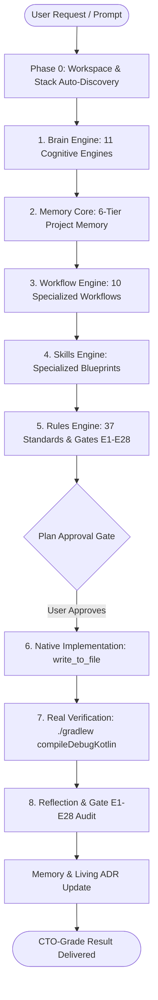

# 🚀 Antigravity Android OS
### The Pragmatic CTO & Android Principal Architect AI Cognitive Operating System
*Zero-Crash. Zero-ANR. Zero-Leak. Zero-AI-Slop. 60/120 FPS by Default.*

[](LICENSE)
[](https://developer.android.com)
[](https://developer.android.com/jetpack/compose)
[](https://developer.android.com/guide/navigation)
[](rules/21-enforcement-engine.md)

---

## 💡 THE MANIFESTO: ANTI-VIBE-CODING

Most AI coding assistants practice **"Vibe Coding"**:
- ❌ Guessing requirements and fabricating fake APIs.
- ❌ Spraying `try-catch` everywhere to hide underlying architecture flaws.
- ❌ Generating clichéd, uninspired "AI-Slop" UI (purple-on-dark neon glow, vibrating biscuit pills, nested cards).
- ❌ Breaking Compose recomposition stability with unkeyed Lazy layouts and unstable lambdas.
- ❌ Claiming tasks are "done" without ever verifying against a real compiler.

**Antigravity Android OS** transforms your AI agent from a fragile auto-complete into a seasoned **Chief Technology Officer (CTO) & Android Principal Architect**. It operates through a deterministic **8-layer cognitive operating system** governed by **28 automated Quality Gates (E1 to E28)**.

---

## 🏛️ THE 8-TIER COGNITIVE ARCHITECTURE

Every engineering request flows through an invariant sequence:



---

## ⚡ ADAPTIVE STACK ARCHITECTURE (HARDWARE ABSTRACTION LAYER)

As a true **AI Cognitive Operating System**, Antigravity automatically detects your active stack during **Phase 0** and binds the corresponding quality drivers without imposing uninvited migrations:

| Domain | Adaptive Drivers (Auto-Detected) | Universal Cognitive Invariant |
|---|---|---|
| **UI System** | Jetpack Compose / Compose Multiplatform | Material 3 Tokens, 60/120 FPS, explicit `key` & `contentType` for Lazy Layouts. |
| **Aesthetics** | [Rule 36 (World-Class UI/UX)](rules/36-ui-ux-design-standard.md) | Subtle 0.5dp borders, tonal surfaces, 8-pt grid. Ban on cliché AI neon slop. |
| **Dependency Injection** | **Koin 4.x** OR **Hilt / Dagger** | Strict Constructor Injection. Zero manual instantiation in Presentation. Scope isolation. |
| **Networking** | **Ktor Client** OR **Retrofit + OkHttp** | Non-blocking I/O (`Dispatchers.IO`), DTO-to-Domain mappers, structured `AppResult<T>` boundary. |
| **Navigation** | **Navigation 3** OR **Jetpack Nav Compose** | Compile-time type safety via Kotlin `@Serializable` routes. 400ms transition debounce. |
| **Local Storage** | **Room Database** OR **SQLDelight** | Single Source of Truth (SSOT), WAL mode enabled, zero data loss migration defense. |
| **Presentation** | MVI / UDF (`BaseViewModel<State, Intent, Effect>`) | Immutable `StateFlow<UIState>` exposed to UI. Pure UI intent emission. |
| **Vitals & Memory** | [App Quality Vitals](skills/app-quality-vitals/SKILL.md) & [Stack vs Heap](skills/stack-heap-memory/SKILL.md) | Zero-Crash, Zero-ANR, Zero-Leak, Startup TTID < 500ms, 16KB page alignment. |

---

## 🛡️ THE 28 QUALITY GATES (E1 — E28)

Before any code modification is reported as complete, it must pass all 28 automated checks defined in [rules/21-enforcement-engine.md](rules/21-enforcement-engine.md):

* **Gates E1 — E5:** Clean Architecture layer boundaries, BaseViewModel inheritance, pure MVI Intent handling.
* **Gates E6 — E10:** Navigation 3 type safety, Single Source of Truth, debounce navigation actions.
* **Gates E11 — E15:** Compose stability, zero hardcoded colors/dp, mandatory `key` & `contentType` on Lazy Layouts.
* **Gates E16 — E20:** Main-Thread purity, structured concurrency, non-cancellable cleanup in WorkManager.
* **Gate E21:** Comprehensive Enforcement Audit before completion.
* **Gate E27:** World-Class Aesthetic Audit (Anti-AI-Slop verification).
* **Gate E28:** Ubiquitous Language & Domain Precision (Zero fluff, domain dictionary alignment).

---

## 📦 QUICKSTART INSTALLATION (IN 60 SECONDS)

### Option 1: One-Line Installer (Recommended)
Run the automated installer in your terminal (macOS / Linux / WSL):
```bash
curl -fsSL https://raw.githubusercontent.com/vinhvox/Anti-Vibe-Coding-Android-Engine/main/scripts/install.sh | bash
```

### Option 2: Clone and Install Locally
```bash
git clone https://github.com/vinhvox/Anti-Vibe-Coding-Android-Engine.git
cd Anti-Vibe-Coding-Android-Engine
bash scripts/install.sh
```

### Option 3: Run Diagnostic Doctor
Verify that your environment (JDK 17+, Android SDK, Git) is fully configured:
```bash
bash scripts/doctor.sh
```

---

## 🗂️ REPOSITORY LAYOUT

```
antigravity-android-os/
├── brain/             # 11 Cognitive engines (Context, Decision, Confidence, Reflection...)
├── rules/             # 37 Standards and Gates E1 to E28
├── workflow/          # 10 Specialized workflows (Implementation, Refactor, Review, Debug...)
├── skills/            # Deep-dive skills (UI/UX Pro Max, Mobile Core, App Vitals, Ask-CTO...)
├── memory/            # 6-Tier memory architecture & baseline Modern Android profile
├── templates/         # Project Memory and Developer Preference starter templates
├── scripts/           # install.sh, doctor.sh, uninstall.sh
├── bin/               # CLI entry points and doctor wrapper
├── docs/              # Comprehensive architecture documentation & ADRs
├── .context-digest.md # 5.4K token compressed instant-boot context
└── README.md          # Project homepage
```

---

## 🛠️ CUSTOMIZING FOR YOUR PROJECT

1. Copy the project template into your repository:
   ```bash
   mkdir -p .antigravity/memory
   cp templates/memory/project-memory.template.md .antigravity/memory/01-project-memory.md
   ```
2. Customize your app's dependencies, database, and package hierarchy.
3. Your AI agent will automatically detect your project's identity and apply the full CTO governance.

---

## 🤝 CONTRIBUTING

We welcome contributions from Android architects, developers, and AI engineers! Please review our [Contributing Guidelines](CONTRIBUTING.md) before submitting a Pull Request.

---

## 📄 LICENSE

This project is licensed under the **Apache License 2.0** — see the [LICENSE](LICENSE) file for details.
