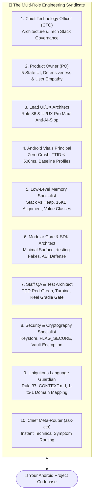
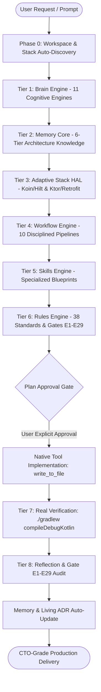
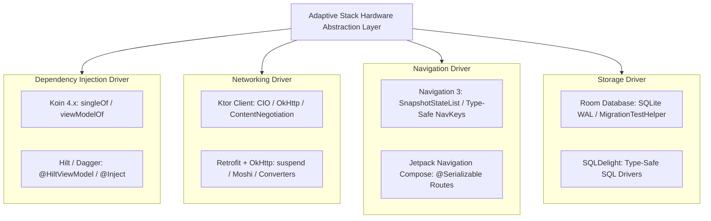

# 🚀 Anti-Vibe-Coding-Android-Engine
### The Multi-Role AI Engineering Syndicate & Cognitive Operating System for Android
*Zero-Crash. Zero-ANR. Zero-Leak. Zero-AI-Slop. 60/120 FPS by Default.*  
**CTO • Product Owner • UI/UX Director • Vitals Principal • Memory Specialist • Security Architect • Modular Architect • Staff QA**

[](LICENSE)
[](https://developer.android.com)
[](https://developer.android.com/jetpack/compose)
[](#-adaptive-stack-architecture-hardware-abstraction-layer)
[](#-the-multi-role-engineering-syndicate)
[](#-the-29-quality-gates-e1--e29-deep-dive)
[](rules/27-app-quality-vitals.md)

---

## 👥 THE MULTI-ROLE ENGINEERING SYNDICATE

Anti-Vibe-Coding-Android-Engine **is not a single monolithic AI persona**. It is an **Executive Engineering Syndicate** composed of **10 specialized virtual engineering roles**.

Depending on the prompt, task, symptom, or project lifecycle phase, the AI dynamically switches its cognitive lens, active skills, and enforcement gates to collaborate like an entire senior engineering department:



### 📋 10-Role Responsibility & Governance Matrix

| # | Specialist / Role | Cognitive Lens & Core Responsibility | Governed Rules & Skills | Invariants & Acceptance Standards |
|:---|:---|:---|:---|:---|
| **1** | **Chief Technology Officer (CTO) & Principal Architect** | Overall architecture, Clean Architecture boundaries, technical debt governance, proactive technical advisory & constructive pushback (**Anti-Yes-Man Protocol**). | `rules/00-system-mandate.md`<br/>`rules/01-architecture.md`<br/>`rules/01-tech-stack.md` | Single Source of Truth (SSOT), strictly forbids presentation leaks into data layer, auto-extracts Living ADRs into `docs/adr/`. |
| **2** | **Product Owner (PO) & Product Strategist** | Product viability, seamless user experience with zero dead-ends, conversion rate optimization. | `memory/06-user-preference-memory.md`<br/>`skills/spec-driven-development` | **5-State UI Matrix** (Empty, Loading, Error, Content, Offline), minimum 48x48dp touch bounds, non-linear 200% font scaling defense. |
| **3** | **Lead UI/UX Architect & Product Design Director** | Completely eliminates rigid AI aesthetic tropes (**Anti-AI-Slop**); enforces premium visual depth and human-grade craft. | `rules/36-ui-ux-design-standard.md`<br/>`skills/ui-ux-pro-max`<br/>**Gate E27** | Subtle 0.5dp translucent borders, layered tonal surfaces, 8-pt grid visual rhythm, 3-tier typography, 0% neon purple glows or vibrating pills. |
| **4** | **Google Play Vitals & Zero-Crash Principal Engineer** | Optimizes Google Play Console vitals, eliminates silent crashes and background ANRs, accelerates cold startup. | `rules/27-app-quality-vitals.md`<br/>`rules/19-build.md`<br/>`skills/app-quality-vitals` | Cold start TTID < 500ms, TTFD < 800ms, 2-Tier Hybrid Splash Orchestration, Baseline Profiles, Zero-Crash & Zero-ANR invariants. |
| **5** | **Low-Level Memory & ART Runtime Specialist** | Stack vs Heap memory discipline, eliminates Garbage Collection (GC) churn in Composable render loops, optimizes 60/120 FPS. | `rules/26-stack-heap-memory.md`<br/>`skills/stack-heap-memory` | Zero object allocations in render loops, mandatory `@JvmInline value class` for IDs, primitive State, 16KB memory page alignment. |
| **6** | **Principal Modular Core & SDK Architect** | Advanced modular design, shared library isolation, host app protection from 3rd-party SDK crashes. | `rules/34-sdk-modular-architecture.md`<br/>`skills/sdk-modular-engineering`<br/>**Gate E25** | All APIs `internal` by default, bundled `:testing` fakes, zero ContentProvider auto-init, binary backward compatibility (ABI). |
| **7** | **Staff QA & Test Automation Architect** | Test-Driven Development (TDD), eliminates flaky tests, asynchronous Flow stream testing. | `rules/20-testing.md`<br/>`rules/22-superpowers-tdd.md`<br/>`rules/30-build-runtime-verification.md` | Red-Green-Refactor lifecycle, Flow testing with Turbine, DI graph validation (`verify()`), mandatory real terminal build gate (`BUILD SUCCESSFUL`). |
| **8** | **Senior Android Security & Cryptography Specialist** | Protects sensitive data at rest and in transit, guards against reverse engineering, device abuse, and tampering. | `rules/17-security.md`<br/>`rules/38-device-network-abuse-policy.md`<br/>**Gate E29** | Hardware Android Keystore, `REQUIRE_SECURE_ENV` container defense, `FLAG_SECURE` compliance, Zero DCL, Android 14+ FGS types, UIDT API. |
| **9** | **Domain Modeler & Ubiquitous Language Guardian** | Unifies business vocabulary between Product and Code, eliminates boilerplate fluff, executes razor-thin vertical slices. | `rules/37-ubiquitous-language-standard.md`<br/>`skills/writing-plans`<br/>**Gate E28** | Living domain dictionary (`CONTEXT.md`), 1-to-1 concept-to-symbol mapping, **Tracer-Bullet Vertical Slicing**, zero-fluff direct communication. |
| **10**| **Chief Engineering Router & Meta-Orchestrator** | Instant diagnosis of technical symptoms and precise routing to the exact specialist skills & quality gates. | `skills/ask-cto/SKILL.md`<br/>`skills/dispatching-parallel-agents` | Routes symptoms (dropped FPS, memory leak, process death, offline sync) to the exact 1-2 skills and quality gates without context bloat. |

---

## 💡 THE MANIFESTO: WHAT IS "ANTI-VIBE-CODING"?

In recent years, AI coding assistants have introduced a massive productivity paradox known as **"Vibe Coding"**:
- ❌ **Guessing & Hallucination:** Fabricating non-existent APIs, guessing business rules, or using deprecated methods without verifying official documentation.
- ❌ **Try-Catch Sprawl:** Wrapping entire screens, ViewModels, or Composable functions in generic `try-catch (e: Exception)` blocks to hide underlying architectural flaws and crashes.
- ❌ **Fake Simulation & Delays:** Inserting dummy `delay(1000)` calls with hardcoded mock lists to fake feature completion, leaving the developer with broken production code.
- ❌ **"AI-Slop" UI:** Generating clichéd, uninspired interfaces (purple-on-dark neon glow, vibrating biscuit pill badges, nested cards 4-levels deep, zero accessibility bounds).
- ❌ **Android Lifecycle Ignorance:** Dropping frames on unkeyed `LazyColumn` layouts, losing form input on screen rotation/Process Death, forgetting keyboard `imePadding()`, and ignoring the 16KB memory page alignment mandated by Android 15+.
- ❌ **False "Done" Claims:** Declaring tasks "completely finished" without ever executing a real terminal compilation command or verifying Gradle test logs.
- ❌ **Dogmatic Library Imposition:** Forcing arbitrary frameworks onto existing legacy codebases, breaking project architecture.

**Anti-Vibe-Coding-Android-Engine** transforms your AI agent from a fragile auto-complete into a **Multi-Role Executive Engineering Syndicate**. It provides a deterministic, **8-layer cognitive operating system** governed by **29 automated Quality Gates (E1 to E29)**, adapting seamlessly to your existing project without dictating your tech stack.

---

### ⚖️ SIDE-BY-SIDE: VIBE CODING VS. ANTI-VIBE-CODING ENGINE

| Engineering Aspect | ❌ The "Vibe Coding" AI Experience | ✅ Anti-Vibe-Coding-Android-Engine |
|:---|:---|:---|
| **Thinking Rhythm** | Immediately spits out code on the first prompt based on intuition and guesswork. | **11-Engine Brain Pipeline:** Clarifies ambiguity, computes confidence score (>=85% required), and plans before touching code. |
| **Error Handling** | Paranoic `try-catch` sprawl across UI and ViewModel to sweep crashes under the rug. | **Structural Safety:** Kotlin null safety, exhaustive `when`, and strict I/O boundary wrapping with `AppResult<T>`. |
| **Feature Delivery** | Injects `delay(1000)` and fake dummy lists, then claims "Feature works perfectly!". | **Stub/Placeholder Ban:** Scans and forbids fake stubs. Binds real DataSources, repositories, and Room entities. |
| **UI/UX Design** | Purple-on-dark neon glowing cards, vibrating pills, unkeyed lists that stutter at 20 FPS. | **Rule 36 & UI/UX Pro Max:** 0.5dp subtle borders, tonal surfaces, 8-pt grid, explicit `key` + `contentType` for 60/120 FPS. |
| **Platform Defense** | App crashes on screen rotation, keyboard covers input fields, rejected on Android 15+ (16KB). | **19 Core Domains:** `SavedStateHandle` process death survival, `.imePadding()`, 16KB memory alignment flags. |
| **Verification Gate** | "I have completed all changes!" (Zero compilation performed, project fails to build). | **Real Compiler Gate:** Mandatory execution of `./gradlew compileDebugKotlin` / `test` with verified `BUILD SUCCESSFUL` output. |
| **Tech Stack Policy** | Dictates "You must use library X", breaking existing code. | **Adaptive Stack HAL:** Auto-detects Hilt vs Koin, Retrofit vs Ktor, and enforces safety on *your* stack. |

---

## 🏛️ THE 8-TIER COGNITIVE OPERATING SYSTEM

Every prompt and feature request processed by the AI flows through an invariant 8-tier cognitive sequence:



### 1. The 11 Cognitive Engines (`brain/`)
The AI thinks before acting through a sequential cognitive pipeline:
1. **Context Engine (`02-context-engine.md`):** Collects codebase architecture, Gradle catalogs, and constraints.
2. **Clarification Engine (`03-clarification-engine.md`):** Identifies missing business logic; stops and clarifies instead of guessing.
3. **Assumption Engine (`04-assumption-engine.md`):** Marks assumptions with reasons and impact; forbids inventing business requirements.
4. **Decision Engine (`05-decision-engine.md`):** Chooses execution strategy (Clarify, Plan, Implement, Refactor, Debug).
5. **Confidence Engine (`06-confidence-engine.md`):** Calculates internal confidence. If < 85%, halts execution to ask the user.
6. **Planning Engine (`07-planning-engine.md`):** Designs Tracer-Bullet Vertical Slices before writing any code.
7. **Execution Engine (`08-execution-engine.md`):** Coordinates disciplined, incremental coding.
8. **Reflection Engine (`09-reflection-engine.md`):** Self-evaluates: Did we solve the real problem? Is there duplicate code?
9. **Enforcement Engine (`21-enforcement-engine.md`):** Audits code against all 29 Quality Gates (E1 to E29).
10. **Initiative Engine (`10-initiative-engine.md`):** Proactively highlights performance risks, memory leaks, and architectural bottlenecks.
11. **Learning Engine (`11-learning-engine.md`):** Extracts reusable design patterns and lessons learned into long-term memory.

### 2. The 6-Tier Memory Core (`memory/`)
Prevents "AI dementia" by preserving stable knowledge across sessions:
* **Project Memory (`01-project-memory.md`):** Active project profile, architecture boundaries, and module graph.
* **Session Memory (`02-session-memory.md`):** Ephemeral conversation context and immediate working objectives.
* **Task Memory (`03-task-memory.md`):** Living task state, dependencies, blockers, and completion criteria.
* **Decision Memory (`04-decision-memory.md`):** Architecture Decision Records (ADRs) to never repeat past mistakes.
* **Pattern Memory (`05-pattern-memory.md`):** Approved UI and architectural patterns verified within the codebase.
* **User Preference Memory (`06-user-preference-memory.md`):** Developer collaboration style, Anti-AI-slop rules, no auto-commit.

---

## ⚡ ADAPTIVE STACK ARCHITECTURE (HARDWARE ABSTRACTION LAYER)

The Anti-Vibe-Coding Engine is **framework-agnostic**. During **Phase 0 (Workspace & Stack Auto-Discovery)**, it inspects your `settings.gradle.kts`, `build.gradle.kts`, or `libs.versions.toml` and binds the corresponding stack driver:



| Architectural Layer | Adaptive Stack Drivers (Auto-Detected) | Universal Cognitive Invariants (Mandatory) |
|:---|:---|:---|
| **UI Toolkit** | Jetpack Compose / Compose Multiplatform | Material 3 Design Tokens, 60/120 FPS, explicit `key` & `contentType` on Lazy Layouts. |
| **Aesthetics** | [Rule 36 (World-Class UI/UX)](rules/36-ui-ux-design-standard.md) | Subtle 0.5dp borders, tonal surfaces, 8-pt grid, anti-AI design clichés. |
| **Dependency Injection** | **Koin 4.x** OR **Hilt / Dagger** | 100% Constructor Injection. Zero manual instantiation in Presentation. Scope isolation. |
| **Networking** | **Ktor Client** OR **Retrofit + OkHttp** | Non-blocking I/O (`Dispatchers.IO`), DTO-to-Domain mappers, structured `AppResult<T>` boundary. |
| **Navigation** | **Navigation 3** OR **Jetpack Nav Compose** | Compile-time type safety via Kotlin `@Serializable` routes. 400ms transition debounce. |
| **Local Storage** | **Room Database** OR **SQLDelight** | Single Source of Truth (SSOT), WAL mode enabled, zero data loss migration defense. |
| **Presentation** | MVI / UDF (`BaseViewModel<State, Intent, Effect>`) | Immutable `StateFlow<UIState>` exposed to UI. Pure UI intent emission. |
| **Android Vitals** | [App Quality Vitals](skills/app-quality-vitals/SKILL.md) & [Stack vs Heap](skills/stack-heap-memory/SKILL.md) | Zero-Crash, Zero-ANR, Zero-Leak, Startup TTID < 500ms, 16KB page alignment. |

---

## 🛡️ THE 29 QUALITY GATES (E1 — E29) DEEP DIVE

Every piece of code generated or reviewed by the AI must pass all 29 automated quality gates defined in [rules/21-enforcement-engine.md](rules/21-enforcement-engine.md):

| Gate ID | Category | Name | Enforcement Invariant |
|:---|:---|:---|:---|
| **Gate E1** | Architecture | **Clean Architecture Boundary** | Domain has zero dependencies on Data or Presentation. |
| **Gate E2** | Presentation | **BaseViewModel Inheritance** | Every ViewModel extends `BaseViewModel<State, Intent, Effect>`. Direct `ViewModel()` is forbidden. |
| **Gate E3** | Concurrency | **Safe Coroutine Scope** | All ViewModel coroutines use `safeLaunch {}`. Direct `viewModelScope.launch` is banned. |
| **Gate E4** | Presentation | **Pure MVI Intent Handling** | `when (intent)` must be exhaustive without an `else ->` wildcard. |
| **Gate E5** | Presentation | **StateFlow Immutability** | Presentation exposes only read-only `StateFlow<UIState>`. MutableStateFlow is strictly private. |
| **Gate E6** | Navigation | **Type-Safe Route Definition** | Internal navigation routes MUST use `@Serializable` classes/objects. Raw string paths are banned. |
| **Gate E7** | Architecture | **Single Source of Truth (SSOT)** | UI observes local database. Network syncs to database; network never feeds UI directly. |
| **Gate E8** | Navigation | **Navigation Debounce** | Navigation actions must debounce with a minimum 400ms threshold to prevent double-push. |
| **Gate E9** | Data | **DTO Boundary Isolation** | DTOs live strictly in Data layer and map to pure Domain models before leaving Repository. |
| **Gate E10**| Data | **Error Boundary Wrapping** | Remote/local operations must wrap exceptions in `AppResult<T>` or `Result<T>`. |
| **Gate E11**| UI | **Design System Token Purity** | Zero hardcoded colors (`Color(0x...)`) or sizes (`16.dp`). 100% mapped to `AppTheme` tokens. |
| **Gate E12**| UI | **Lazy Layout Key Stability** | Every item in `LazyColumn`/`LazyRow` MUST specify an explicit `key = { it.id }` and `contentType`. |
| **Gate E13**| UI | **Recomposition Stability** | External models annotated with `@Immutable` or `@Stable`. Lambdas memoized via `remember`. |
| **Gate E14**| UI | **Dark Theme Compatibility** | Direct use of `Color.White` or `Color.Black` is forbidden. All surfaces adapt to theme mode. |
| **Gate E15**| UI | **Accessibility Bounds** | All clickable elements have a minimum touch target of 48x48dp (`minimumInteractiveComponentSize`). |
| **Gate E16**| Concurrency | **Main-Thread Purity** | Zero blocking calls or file/network I/O on `Dispatchers.Main`. All I/O runs on `Dispatchers.IO`. |
| **Gate E17**| Concurrency | **Cancellation Preservation** | Never swallow `CancellationException` in coroutine exception handling blocks. |
| **Gate E18**| Background | **WorkManager NonCancellable** | Deferrable background work uses WorkManager. Cleanup blocks run in `NonCancellable`. |
| **Gate E19**| Storage | **Database WAL & Migrations** | Room database configured with WAL mode. `fallbackToDestructiveMigration()` forbidden in prod. |
| **Gate E20**| Security | **Hardware Keystore & Security** | Tokens stored in `EncryptedSharedPreferences` / Keystore. `FLAG_SECURE` on payment screens. |
| **Gate E21**| Audit | **Enforcement Pre-Delivery Audit**| Full self-audit across modified files. Zero violations tolerated before task handover. |
| **Gate E22**| Minimalism | **Anti-Overengineering Gate** | Zero redundant wrappers or 1-line delegate UseCases. Ponytail minimalist standard. |
| **Gate E23**| Resilience | **The 7 AI Blind Spots Defense** | SavedStateHandle survives Process Death, `.imePadding()`, JIT permissions, zero fake delays. |
| **Gate E24**| Testing | **Modern Testing & QA Gate** | StateFlow emissions tested via Turbine. Fakes preferred over fragile mocks. |
| **Gate E25**| SDK/Core | **Modular Public Surface Isolation**| Core libraries use `internal` by default. Pluggable `:testing` fakes provided. |
| **Gate E26**| Release | **DB Migration & R8 ProGuard Gate** | ProGuard `consumer-rules.pro` synthesized. Release builds verified with R8 minification. |
| **Gate E27**| Aesthetic | **World-Class UI/UX Audit** | Zero purple neon AI clichés. Subtle 0.5dp borders, tonal depth, 8-pt grid, domain palette. |
| **Gate E28**| Domain | **Ubiquitous Language & Precision** | 1-to-1 mapping between business domain dictionary (`CONTEXT.md`) and code symbols. Zero fluff. |
| **Gate E29**| Policy | **Google Play Device & Network Abuse Defense** | Zero DCL, Android 14+ FGS types, UIDT API, REQUIRE_SECURE_ENV container defense, FLAG_SECURE compliance. |

---

## 📱 THE 19 CORE MOBILE ENGINEERING DOMAINS

The engine embeds deep architectural defenses across the 19 core mobile domains defined in [rules/31-mobile-engineering-core.md](rules/31-mobile-engineering-core.md):

```
1. Lifecycle & State Management    7. Adaptive UI & Insets            13. Cross-Platform Bridge
2. Background Execution           8. Accessibility (a11y)            14. System Integrations (Camera/Sensors)
3. Permissions & Privacy           9. Localization & Theming          15. Security & Cryptography
4. Networking & Offline-First     10. Concurrency & Asynchronous Flow 16. Build & 16KB Release Engineering
5. Persistence & Migration        11. Performance & Android Vitals   17. Observability, Telemetry & Tracing
6. Navigation & Deep Links        12. Platform-Specific Behaviors    18. Testing & Automation Strategy
                                                                     19. Complete Failure Modeling
```

---

## 👁️ THE 7 AI BLIND SPOTS DEFENSE MATRIX

AI models typically introduce 7 recurring architectural bugs when generating Android code. The engine automatically monitors and blocks them:

1. **Lazy Layout Recomposition Lag:** AI forgets `key = { it.id }` and `contentType`, causing Compose to recompose the entire list on every state change and dropping FPS to 20.  
   *Engine Fix:* Gate E12 automatically checks and requires `key` on every Lazy list item.
2. **Duplicate Click Race Conditions:** Fast double-tapping a button launches duplicate network requests or pushes duplicate screens onto the backstack.  
   *Engine Fix:* Mandates ViewModel-level click locks and a 400ms navigation debounce.
3. **Loss of Form State on Rotation / Process Death:** AI uses simple `remember { mutableStateOf("") }` which resets user inputs when the device rotates or Android OS reclaims memory.  
   *Engine Fix:* Mandates `rememberSaveable` or hoisting state into `SavedStateHandle`.
4. **Keyboard Covering Input Fields:** Bottom input fields become inaccessible when the soft keyboard appears.  
   *Engine Fix:* Mandates `Modifier.imePadding()` with scrollable containers and `BringIntoViewRequester`.
5. **String Concatenation in UI:** AI writes `Text("$count items")` or `Text("$ " + price)`, breaking pluralization and localization rules.  
   *Engine Fix:* Mandates `pluralStringResource` and localized string templates.
6. **Fake Simulations & Delays:** AI adds `delay(1000)` and fake dummy lists when it doesn't know how to implement the real API.  
   *Engine Fix:* Stub/Placeholder detection blocks fake delays and requires real DataSource bindings.
7. **16KB Memory Page Alignment Blindness:** Starting in Android 15, all native C/C++ libraries (`.so`) MUST be aligned to 16KB page boundaries or the app crashes immediately on launch.  
   *Engine Fix:* Rule 19 & Rule 31 automatically enforce 16KB linker flags (`-Wl,-z,max-page-size=16384`) and audit 3rd-party dependencies.

---

## 📦 QUICKSTART INSTALLATION (IN 60 SECONDS)

### Option 1: One-Line Automated Installer (Recommended)
Run this single command in your terminal (macOS / Linux / WSL):
```bash
curl -fsSL https://raw.githubusercontent.com/vinhvox/Anti-Vibe-Coding-Android-Engine/main/scripts/install.sh | bash
```
The installer automatically:
1. Detects your operating system and shell environment.
2. Installs or updates the engine into `~/.antigravity`.
3. Auto-configures **Antigravity CLI (`agy`)** by binding the System Mandate in `~/.gemini/GEMINI.md` and symlinking skills into `~/.gemini/antigravity-cli/skills/`.
4. Grants execution permissions and runs an automated environment diagnostic.

### Option 2: Clone and Install Locally
```bash
git clone https://github.com/vinhvox/Anti-Vibe-Coding-Android-Engine.git
cd Anti-Vibe-Coding-Android-Engine
bash scripts/install.sh
```

### Option 3: Initialize in an Existing Android Project
To bind the engine and project memory directly to any Android / KMP project repository:
```bash
cd /path/to/your/android-project
bash ~/.antigravity/scripts/init-project.sh
```

### Option 4: Run Diagnostic Health Check
Verify that your development environment (JDK 17+, Android SDK, Git) is fully configured:
```bash
bash ~/.antigravity/scripts/doctor.sh
```

---

## ❓ ANTIGRAVITY CLI FAQ & TROUBLESHOOTING

### Q: Why does the initial Antigravity CLI terminal screen look default?
> **Answer:** The initial startup ASCII header (*"Welcome to Antigravity CLI"*) is compiled statically into the `agy` binary. The engine's **CTO Persona, 38 Standards, and 29 Quality Gates** live inside the AI's cognitive pipeline and are activated upon your very first message or tool call.

### Q: How do I verify that the engine is active in Antigravity CLI?
> **Answer:** Run `agy` in your terminal and test either of these:
> 1. Type `/skills` — You will see custom skills listed (`ask-cto`, `ui-ux-pro-max`, `app-quality-vitals`, etc.).
> 2. Ask: *"Who are you and what rules do you follow?"* — The assistant will immediately identify as the **CTO & Android Principal Architect** enforcing the 38 Standards and 29 Quality Gates (E1–E29).

---

## 🛠️ CUSTOMIZING FOR YOUR PROJECT

The engine is 100% plug-and-play. To customize it for a specific project repository:

1. Run the project initializer inside your project's root:
   ```bash
   bash ~/.antigravity/scripts/init-project.sh
   ```
2. Or copy the project memory template manually:
   ```bash
   mkdir -p .antigravity/memory
   cp templates/memory/project-memory.template.md .antigravity/memory/01-project-memory.md
   ```
3. Fill in your application's details (Package name, active DI framework, database, and repository boundaries).
4. Any AI coding assistant (Antigravity CLI, Cursor, Claude Code, Gemini CLI) will automatically discover your project's profile and enforce CTO-grade engineering.

---

## 🤖 AI COMPATIBILITY MATRIX

Anti-Vibe-Coding-Android-Engine is designed to empower any modern AI coding tool:

| AI Tool / Environment | Integration Method | Supported Features |
|:---|:---|:---|
| **Google Antigravity CLI (`agy`)** | Native custom framework (`~/.antigravity`) | Full 8-tier cognitive pipeline, skills, subagents, rules, auto-hooks. |
| **Cursor IDE** | Include as `.cursorrules` or system prompt reference | Full 29 Quality Gates, Clean Architecture enforcement, Rule 36 UI/UX. |
| **Claude Code (Anthropic)** | Load via `CLAUDE.md` linking to `.context-digest.md` | Invariant enforcement, Tracer-Bullet planning, compiler verification. |
| **Gemini CLI** | Native custom configuration | Brain reasoning, adaptive HAL, zero-crash default invariant. |
| **Windsurf / GitHub Copilot** | Workspace rules reference | Compose stability, design system token purity, 19 core mobile domains. |

---

## 🗂️ REPOSITORY DIRECTORY LAYOUT

```
Anti-Vibe-Coding-Android-Engine/
├── .github/
│   ├── workflows/lint-and-validate.yml  # GitHub Actions CI for path sanitization & syntax
│   └── ISSUE_TEMPLATE/                  # Standardized bug reports & feature requests
├── bin/
│   ├── agy-doctor                       # Fast CLI diagnostic shortcut
│   └── load-antigravity.py              # Context bootstrap utility
├── brain/                               # 11 Cognitive engines (Context, Clarification, Decision...)
│   ├── 00-master-cognition.md
│   ├── ...
│   └── 11-learning-engine.md
├── rules/                               # 38 Standards & Gates E1 to E29
│   ├── 00-system-mandate.md             # Highest system priority mandate
│   ├── 01-tech-stack.md                 # Adaptive Stack Hardware Abstraction Layer (HAL)
│   ├── 09-networking.md                 # Ktor Client & Retrofit + OkHttp standards
│   ├── 12-dependency-injection.md       # Koin 4.x & Hilt/Dagger standards
│   ├── 21-enforcement-engine.md         # The 29 Quality Gates (E1 to E29)
│   ├── 31-mobile-engineering-core.md    # The 19 Core Mobile Engineering Domains
│   ├── 36-ui-ux-design-standard.md      # World-Class UI/UX & Anti-AI-Slop standard
│   ├── 37-ubiquitous-language-standard.md # Domain Dictionary & Ubiquitous Language standard
│   └── 38-device-network-abuse-policy.md # Google Play Device & Network Abuse policy
├── workflow/                            # 10 Specialized engineering workflows
│   ├── 00-master-workflow.md            # Central orchestrator (Phases 0 to 8)
│   ├── 03-architecture-design.md        # Architecture design & driver binding
│   ├── 04-implementation-planning.md    # Tracer-Bullet Vertical Slicing planning
│   ├── 06-code-review.md                # Gates E1-E29 code review audit
│   └── 07-testing-validation.md         # Mandatory real terminal compiler execution
├── skills/                              # Specialized drop-in domain skills
│   ├── ask-cto/                         # Meta-router for instant technical diagnosis
│   ├── ui-ux-pro-max/                   # 240+ UI styles, 170+ palettes, 150+ font pairings
│   ├── app-quality-vitals/              # Google Play Vitals, Zero-Crash, TTID < 500ms
│   ├── stack-heap-memory/               # Stack vs Heap memory allocation discipline
│   ├── ponytail-minimalist/             # Zero over-engineering & Kotlin idioms
│   ├── spec-driven-development/         # Tri-Artifact standard (Spec -> Plan -> Tasks)
│   └── systematic-debugging/            # 4-step scientific root cause analysis
├── memory/                              # 6-Tier memory architecture & generic profile
│   ├── 00-memory-core.md
│   └── 01-project-memory.md
├── templates/                           # Reusable project starter templates
│   └── memory/
│       ├── project-memory.template.md   # App identity & architecture template
│       └── user-preference.template.md  # Developer preferences template
├── scripts/                             # Automation scripts
│   ├── install.sh                       # Automated curl-to-bash installer
│   ├── doctor.sh                        # Environment diagnostic health check
│   └── uninstall.sh                     # Safe uninstaller with backup archiving
├── .context-digest.md                   # Ultra-dense 5.4K token instant boot context
├── INDEX.md                             # Full cross-reference index
├── CONTRIBUTING.md                      # Open-source contribution guidelines
├── LICENSE                              # Apache License 2.0
├── README.md                            # Comprehensive project homepage
└── install.sh                           # Root installer convenience wrapper
```

---

## 🤝 CONTRIBUTING

We welcome contributions from Android architects, mobile engineers, and AI developers passionate about bringing true engineering rigor to AI coding assistants!

Please read our [Contributing Guidelines](CONTRIBUTING.md) to learn how to propose new Quality Gates, domain skills, or architectural drivers.

---

## 📄 LICENSE

This project is open-sourced under the **Apache License 2.0** — see the [LICENSE](LICENSE) file for details.
