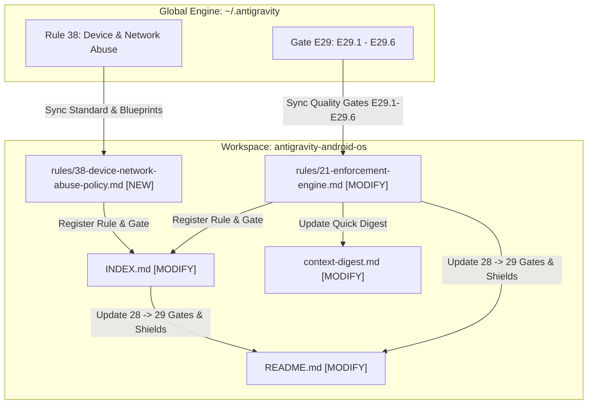

# Implementation Plan: Synchronize Rule 38 & Gate E29 to `antigravity-android-os`

## Goal Description
Synchronize the newly established **Rule 38: Google Play Device & Network Abuse Policy Standard** and **Gate E29 (Quality Gates E29.1 to E29.6)** from the global framework (`~/.antigravity/`) into the active workspace repository [`antigravity-android-os`](file:///Users/vio/Documents/ViO/antigravity-android-os) (`Anti-Vibe-Coding-Android-Engine`).

This upgrade expands the engine from **37 Standards & 28 Quality Gates (E1–E28)** to **38 Standards & 29 Quality Gates (E1–E29)**, enforcing strict compliance with Google Play Device & Network Abuse policies (Zero DCL, Android 14+ FGS types, UIDT API, `REQUIRE_SECURE_ENV` container defense, `FLAG_SECURE` compliance, and untrusted WebView hardening) across all documentation, enforcement scans, and context digests in 100% idiomatic English.

---

## User Review Required

> [!NOTE]
> All new documentation and rule files in [`antigravity-android-os`](file:///Users/vio/Documents/ViO/antigravity-android-os) strictly adhere to the repository's 100% English convention established in commit `00fc2b9`.

> [!IMPORTANT]
> This synchronization updates core framework files including [`README.md`](file:///Users/vio/Documents/ViO/antigravity-android-os/README.md), [`INDEX.md`](file:///Users/vio/Documents/ViO/antigravity-android-os/INDEX.md), [`.context-digest.md`](file:///Users/vio/Documents/ViO/antigravity-android-os/.context-digest.md), [`rules/21-enforcement-engine.md`](file:///Users/vio/Documents/ViO/antigravity-android-os/rules/21-enforcement-engine.md), and adds [`rules/38-device-network-abuse-policy.md`](file:///Users/vio/Documents/ViO/antigravity-android-os/rules/38-device-network-abuse-policy.md).

---

## Open Questions
None. The specifications, blueprints, and gate definitions are already formalized and verified in `~/.antigravity/rules/38-device-network-abuse-policy.md` and `~/.antigravity/rules/21-enforcement-engine.md`.

---

## Proposed Changes



### 1. Rules Engine

#### [NEW] [`rules/38-device-network-abuse-policy.md`](file:///Users/vio/Documents/ViO/antigravity-android-os/rules/38-device-network-abuse-policy.md)
- Establish the complete Google Play Device and Network Abuse Policy Standard:
  - **Pillar 1:** Absolute Ban on Dynamic Code Loading (Zero DCL: no runtime `.dex`, `.jar`, `.so` download).
  - **Pillar 2:** Android 14+ Foreground Service (FGS) Type & Eligibility (user-initiated, stoppable, explicit types).
  - **Pillar 3:** User-Initiated Data Transfer (UIDT) Jobs API standard.
  - **Pillar 4:** `FLAG_SECURE` Compliance & Surface Protection (`SecureScreenEffect`).
  - **Pillar 5:** On-Device Android Containers Defense (`REQUIRE_SECURE_ENV`).
  - **Pillar 6:** Proxy/VPN Services, Sandboxing & Anti-Abuse.
  - **Blueprints:** `SecureScreenEffect` Composable & `FileUploadWorker` WorkManager.
  - **Enforcement Checklist:** 6-point pre-submit verification checklist.

#### [MODIFY] [`rules/21-enforcement-engine.md`](file:///Users/vio/Documents/ViO/antigravity-android-os/rules/21-enforcement-engine.md)
- Insert `CATEGORY E29: GOOGLE PLAY DEVICE & NETWORK ABUSE POLICY GATES (Rule 38)`:
  - `E29.1`: Zero Dynamic Code Loading (Zero DCL) Gate.
  - `E29.2`: Android 14+ Foreground Service (FGS) Eligibility & Declaration Gate.
  - `E29.3`: On-Device Android Container Defense Gate (`REQUIRE_SECURE_ENV`).
  - `E29.4`: `FLAG_SECURE` Anti-Bypass & Surface Protection Gate.
  - `E29.5`: WebView Untrusted JavaScript Interface Gate.
  - `E29.6`: User-Initiated Data Transfer (UIDT) & Anti-Proxy Gate.
- Update **Execution Protocol** to incorporate Gate E29 checks into:
  - Background & Hardware: `E21.2 + E21.3 + E21.14 + E29 (Device & Network Abuse Policy)`
  - Security & Storage: `E21.15 + E29.3 (Container Defense) + E29.4 (FLAG_SECURE)`
  - New feature complete audit list (E1 to E29).

---

### 2. Framework Indexes & Digest

#### [MODIFY] [`INDEX.md`](file:///Users/vio/Documents/ViO/antigravity-android-os/INDEX.md)
- Add Rule 38 and Gate E29 entry to the **Rules & Gates Mapping Table**:
  ```markdown
  | `38-device-network-abuse-policy` | E29 (Google Play Device & Network Abuse Gates) | Zero DCL, Android 14+ FGS types, UIDT API, REQUIRE_SECURE_ENV container defense, FLAG_SECURE compliance |
  ```

#### [MODIFY] [`.context-digest.md`](file:///Users/vio/Documents/ViO/antigravity-android-os/.context-digest.md)
- Add Gate E29 to **Section 5: AUTOMATED QUALITY GATES (E1 — E29)**:
  ```markdown
  - **E29:** Google Play Device & Network Abuse Gates (Zero DCL, Android 14+ FGS Types, UIDT API, REQUIRE_SECURE_ENV Container Defense, FLAG_SECURE Compliance, Untrusted WebView Guard).
  ```

---

### 3. Public Documentation & Architecture Showcase

#### [MODIFY] [`README.md`](file:///Users/vio/Documents/ViO/antigravity-android-os/README.md)
- Update badge: `Quality_Gates-E1_to_E28` ➔ `Quality_Gates-E1_to_E29`.
- Update header: `THE 28 QUALITY GATES (E1 — E28) DEEP DIVE` ➔ `THE 29 QUALITY GATES (E1 — E29) DEEP DIVE`.
- Update cognitive architecture flowchart: `Rules Engine - 37 Standards & Gates E1-E28` ➔ `Rules Engine - 38 Standards & Gates E1-E29`.
- Update reflection tier flowchart: `Reflection & Gate E1-E28 Audit` ➔ `Reflection & Gate E1-E29 Audit`.
- Update Multi-Role table: Role 8 (Senior Android Security & Cryptography Specialist) to reference Rule 38 and Gate E29.
- Add **Gate E29** row to the Quality Gates table:
  ```markdown
  | **Gate E29**| Policy | **Google Play Device & Network Abuse Defense** | Zero DCL, Android 14+ FGS types, UIDT API, REQUIRE_SECURE_ENV container defense, FLAG_SECURE compliance. |
  ```
- Update framework file tree and IDE integration sections from 28 to 29 Quality Gates and 37 to 38 Standards.

---

### 4. Local Plan Documentation

#### [NEW] [`plan/2026-09-09-sync-rule38-gate-e29.md`](file:///Users/vio/Documents/ViO/antigravity-android-os/plan/2026-09-09-sync-rule38-gate-e29.md)
- Persist a copy of this implementation plan directly into `plan/` in the project root to satisfy the user preference rule.

---

## Verification Plan

### Automated Checks & Link Verification
- Verify file existence and markdown consistency using `view_file` and `grep_search`.
- Check that all internal relative links in [`INDEX.md`](file:///Users/vio/Documents/ViO/antigravity-android-os/INDEX.md) and [`README.md`](file:///Users/vio/Documents/ViO/antigravity-android-os/README.md) target existing files.
- Grep across the entire repository to confirm that any leftover references to "28 Quality Gates" or "37 Standards" are updated consistently without regression.

### Git Status Check
- Run `git status` to verify clean changes matching the plan.
- Confirm zero auto-commits (strictly adhering to the `Mandatory No Auto-Commit Mandate`).
