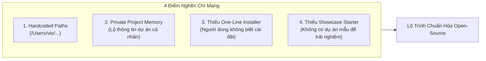
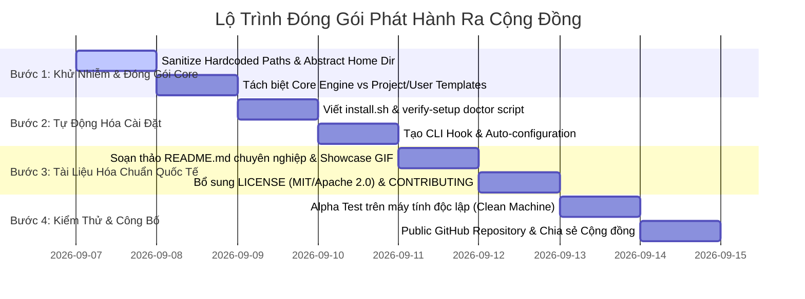

# COMMUNITY RELEASE READINESS ASSESSMENT & IMPLEMENTATION PLAN
**Target:** Đóng gói và phát hành Bộ Workflow / Framework Antigravity AI Engine ra cộng đồng Open-Source (GitHub / Community)  
**Evaluator:** Chief Technology Officer (CTO) & Product Owner (PO)  
**Readiness Score:** **85% (Core Ready) / 15% Remaining (Packaging & Portability Blocker)**

---

## 🎯 1. CTO / PO STRATEGIC ASSESSMENT

### Giá Trị Cốt Lõi (Unique Value Proposition - UVP)
Bộ framework hiện tại sở hữu chiều sâu kỹ thuật vượt trội mà hầu như chưa có bộ AI Agent Workflow nào trên thị trường đạt được:
* **Anti-Vibe-Coding:** Thay thế việc sinh code ngẫu nhiên bằng chuỗi 8 tầng nhận thức kỷ luật (`Brain` ➔ `Memory` ➔ `Workflow` ➔ `Skills` ➔ `Rules` ➔ `Gate E1-E28` ➔ `Verification`).
* **Zero-Crash / Zero-ANR / Zero-Leak Invariants:** Cơ chế phòng vệ bằng cấu trúc (Structural Safety) thay vì bọc `try-catch` lung tung.
* **World-Class UI/UX (Anti-AI-Slop):** Loại bỏ hoàn toàn định kiến "giao diện AI thô kệch" nhờ Rule 36 & `ui-ux-pro-max` (viền 0.5dp, tonal surfaces, nhịp 8-pt, typography 3 tầng).
* **Kiến trúc Modern Android 2026:** Jetpack Compose M3, Navigation 3 type-safe, Antigravity MVI/UDF, Koin, Ktor, Room, và 19 Miền Kỹ thuật Di động.

### Kết Luận Sẵn Sàng (Verdict)
> [!WARNING]
> **CHƯA NÊN BẤM NÚT PUBLIC NGAY LẬP TỨC.**  
> Về mặt **nội dung và tư duy kiến trúc (Core Intelligence)**, bạn đã hoàn thành **100%**.  
> Tuy nhiên, về mặt **đóng gói sản phẩm (Packaging, Portability & Developer Experience)**, hệ thống vẫn còn **4 điểm nghẽn chí mạng** khiến một lập trình viên ngoài cộng đồng khi clone về sẽ gặp lỗi ngay từ bước đầu tiên hoặc bị lộ dữ liệu cá nhân.

---

## ⚠️ 2. 4 ĐIỂM NGHẼN CHÍ MẠNG CẦN XỬ LÝ TRƯỚC KHI PUBLIC



### Điểm Nghẽn 1: Hardcoded Paths (Đường dẫn Tuyệt đối Cá nhân)
* **Thực trạng:** Trong các file quy tắc (`00-system-mandate.md`, `00-master-workflow.md`, `user_rules`), xuất hiện cố định đường dẫn `/Users/vio/.antigravity/` và `/Users/vio/Documents/ViO/...`.
* **Rủi ro:** Khi một lập trình viên khác clone về máy (Windows, Linux, hoặc Mac với username `john`), agent sẽ lập tức lỗi đường dẫn do không tìm thấy `/Users/vio/`.
* **Giải pháp:** Chuyển toàn bộ sang biến môi trường `$ANTIGRAVITY_HOME`, đường dẫn tương đối `~/.antigravity`, hoặc script tự động thay thế path khi cài đặt.

### Điểm Nghẽn 2: Private Project Memory (Dữ liệu Dự án Cá nhân bị lẫn vào Core)
* **Thực trạng:** `memory/01-project-memory.md` và `memory/06-user-preference-memory.md` hiện chứa các cấu hình cụ thể của dự án riêng (`Base-Jetpack_2026`, `WebShare`, `Zip4j 2.11.5`).
* **Rủi ro:** Lộ lọt thông tin dự án cá nhân; cộng đồng clone về bị "ô nhiễm ngữ cảnh" với các thư viện họ không dùng.
* **Giải pháp:** Phân tách rành mạch thành 2 phần:
  1. **Framework Core:** Giữ lại các engine, quy tắc, skills chung (`rules/`, `brain/`, `workflow/`, `skills/`).
  2. **Template Profiles:** Cung cấp `project-memory.template.md` và `user-preference.template.md` để người dùng mới tự khởi tạo theo dự án của họ.

### Điểm Nghẽn 3: Trải Nghiệm Cài Đặt (Developer Experience - DX)
* **Thực trạng:** Hiện tại bộ khung được cấu hình thủ công vào thư mục ẩn `~/.antigravity/`.
* **Rủi ro:** Người dùng cộng đồng sẽ nản lòng nếu phải đọc hướng dẫn copy từng file thủ công.
* **Giải pháp:** Viết một script cài đặt 1 dòng (One-Line Installer) chuẩn quốc tế:
  ```bash
  curl -fsSL https://raw.githubusercontent.com/your-username/antigravity-core/main/install.sh | bash
  ```
  Script này tự động: clone repository vào `~/.antigravity`, cấp quyền thực thi, cấu hình hook CLI, và kiểm tra môi trường (`doctor`).

### Điểm Nghẽn 4: Thiếu Showcase Project (Dự Án Mẫu Minh Chứng)
* **Thực trạng:** Cộng đồng cần "thấy tận mắt" khả năng của framework trước khi áp dụng vào dự án production.
* **Giải pháp:** Cung cấp kèm một repository Starter Kit mẫu (hoặc module `:sample`):
  * Cấu trúc thư mục Clean Architecture chuẩn.
  * Mẫu màn hình Compose M3 đạt điểm tuyệt đối UI/UX Pro Max (viền 0.5dp, 5-State UI).
  * Mẫu ViewModel kế thừa `BaseViewModel<State, Intent, Effect>`.
  * Navigation 3 type-safe routes.

---

## 💡 3. KẾ HOẠCH HÀNH ĐỘNG 4 BƯỚC (ACTIONABLE ROADMAP)



### Chi Tiết Từng Bước Thực Thi:

#### Bước 1: Khử Nhiễm Mã Nguồn & Trừu Tượng Hóa Thư Mục (Sanitization)
1. Quét toàn bộ thư mục `~/.antigravity/` để thay thế `/Users/vio/` bằng `~/.antigravity` hoặc `$HOME/.antigravity`.
2. Tạo thư mục `templates/`:
   * `templates/memory/project-memory.template.md`
   * `templates/memory/user-preference.template.md`
3. Làm sạch `memory/01-project-memory.md` thành bản khung chuẩn chung (Generic Android Native & KMP Profile).

#### Bước 2: Xây Dựng Bộ Cài Đặt Tự Động (One-Line Installer & Doctor)
Tạo tệp `install.sh` nằm ở gốc repository:
* Tự động phát hiện OS (macOS / Linux / WSL).
* Sao chép hoặc symlink bộ khung vào `~/.antigravity`.
* Chạy kiểm tra tính toàn vẹn (Checksum / Verification Gate check).
* Xuất lệnh cấu hình vào `~/.gemini/antigravity-cli/config.json` hoặc shell environment.

#### Bước 3: Hoàn Thiện Bộ Tài Liệu Mở (Open-Source Standards)
1. **`README.md` Thượng Hạng:**
   * Tiêu đề: **Antigravity Engine — The Pragmatic CTO & Android Principal Architect AI Framework**.
   * Badge: Version 2026, Android Vitals Zero-Crash, Navigation 3 Ready, Material 3 BOM.
   * So sánh tương phản: *Vibe Coding (AI Slop, Try-Catch Sprawl, Broken Navigation)* vs *Antigravity Engine (Structural Safety, 28 Quality Gates, World-Class UI/UX)*.
   * Hướng dẫn Quickstart 3 bước (Cài đặt ➔ Khởi động ➔ Trải nghiệm).
2. **`LICENSE`:** Chọn **Apache 2.0** hoặc **MIT** để cộng đồng doanh nghiệp an tâm tích hợp.
3. **`CONTRIBUTING.md`:** Hướng dẫn cộng đồng đóng góp thêm Skills, Rules và Quality Gates mới.

#### Bước 4: Kiểm Thử Thực Tế Trên Môi Trường Trắng (Clean Environment Testing)
* Tạo một user mới trên máy Mac hoặc chạy trên máy ảo/Docker sạch.
* Chạy lệnh `curl ... | bash` và kiểm tra xem Agent có khởi động trơn tru 100% mà không bị bất kỳ lỗi thiếu file hay sai quyền hạn nào.

---

## 4. KẾT LUẬN & ĐỀ XUẤT HÀNH ĐỘNG TIẾP THEO

Bộ quy chuẩn và trí tuệ bạn đã dày công đúc kết là **cực kỳ giá trị đối với cộng đồng Android Developer và AI Coding hiện nay**. Nó giải quyết chính xác nỗi đau lớn nhất của ngành: AI viết code ẩu, thiếu an toàn và sinh giao diện thô cứng.

Nếu bạn đồng ý với kế hoạch trên, chúng ta có thể bắt tay ngay vào **Bước 1: Khử nhiễm các đường dẫn hardcoded và đóng gói bộ khung thành một cấu trúc repository mẫu hoàn chỉnh** ngay trong thư mục workspace này!
