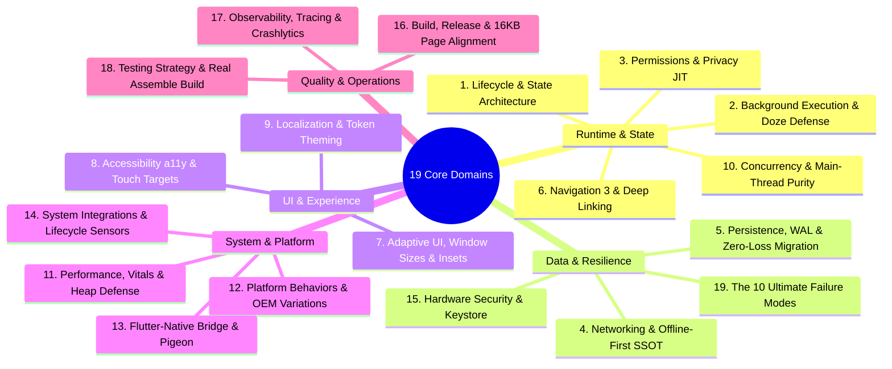

# 31 - Mobile Engineering Core Matrix Mandate

## Purpose

This document establishes the **Mobile Engineering 19 Core Matrix Mandate** as a mandatory architectural standard for all mobile applications (Android Native, Jetpack Compose, Kotlin Multiplatform, and Flutter/Native bridges).

Mobile operating systems are inherently hostile environments where process termination, network instability, memory pressure, OS version fragmentation, and permission revocations occur continuously.

Every engineering task—whether designing, coding, refactoring, reviewing, or testing—MUST actively defend against these 19 core domains.

---

# The 19 Core Engineering Domains

---

# Domain Mandates & Technical Contracts

### 1. Lifecycle & State Mandate
- **Rule 31.1 (3-Tier State)**: UI state must be categorized into Ephemeral (`remember`), Re-creation Safe (`rememberSaveable` / `SavedStateHandle`), or Persistent Domain (`Room` / `DataStore`).
- **Process Death Defense**: ViewModel state must survive Configuration Changes; `SavedStateHandle` must store minimal keys to re-hydrate state upon Process Death.
- **Bundle Limitation**: State bundles must never exceed 500KB (avoid `TransactionTooLargeException`).

### 2. Background Execution & Doze Mandate
- **Rule 31.2 (WorkManager Task Categorization)**: All deferrable or guaranteed tasks must use `WorkManager` with explicit `Constraints` and `BackoffPolicy.EXPONENTIAL`.
- **Cooperative Cancellation**: Every `CoroutineWorker` must check `isStopped` in loops and wrap critical resource cleanups in `withContext(NonCancellable)`.

### 3. Permissions & Privacy Mandate
- **Rule 31.3 (Just-In-Time Verification)**: Permissions must never be cached in static variables. Always check `ContextCompat.checkSelfPermission` immediately before invoking hardware APIs.
- **Zero-Permission First**: Use modern system pickers (e.g. `PickVisualMedia`) where possible. Provide graceful degradation and direct Settings navigation on permanent denial.

### 4. Networking & Offline-First Mandate
- **Rule 31.4 (Single Source of Truth - SSOT)**: UI observes only the local database (`Room`). Network requests write to Room; UI reacts to database emissions.
- **Outbox Pattern**: Offline mutations must be queued in an Outbox table with UUID v4 idempotency keys and exponential backoff retry.

### 5. Persistence, Migration & Data Integrity Mandate
- **Rule 31.5 (Zero Data Loss)**: `fallbackToDestructiveMigration()` is STRICTLY FORBIDDEN on production schemas.
- **Mandatory Migration Tests**: All schema migrations must be tested with `MigrationTestHelper`. Enable SQLite WAL mode and `@Transaction` for dependent writes.

### 6. Navigation & Routing Mandate
- **Rule 31.6 (State-Driven Navigation 3)**: Navigation backstack must be a reactive `SnapshotStateList<NavKey>`.
- **Type-Safe Routes**: Forbid string-based URI routing internally. Use Kotlin `@Serializable` destinations.
- **Synthetic Backstack**: Deep links must automatically synthesize parent hierarchical backstacks. Single-click debounce (< 400ms) is mandatory.

### 7. Adaptive UI & System Insets Mandate
- **Rule 31.7 (WindowSizeClass & Edge-to-Edge)**: All screens must support `Compact`, `Medium`, and `Expanded` breakpoints.
- **Safe Insets & IME**: Enforce `enableEdgeToEdge()` with `WindowInsets.safeDrawing` and `.imePadding()`.

### 8. Accessibility (a11y) Mandate
- **Rule 31.8 (48dp Touch Target & Dynamic Text)**: All interactive elements must have minimum 48x48dp touch bounds (`minimumInteractiveComponentSize()`).
- **Non-Linear Text Scaling**: Support up to 200% font scaling without layout clipping. Provide explicit `contentDescription` or `Role` semantics for interactive components.

### 9. Localization & Theming Mandate
- **Rule 31.9 (RTL Safety & Semantic Theming)**: Layout modifiers must use `start`/`end` instead of `left`/`right`.
- **Plurals & Formatting**: Use `getQuantityString` for counts. 100% colors and typography must resolve through centralized `AppTheme` tokens.

### 10. Concurrency & Flow Mandate
- **Rule 31.10 (Main-Thread Purity)**: Zero blocking operations on `Dispatchers.Main`.
- **Atomic State Updates**: Use `_state.update { copy(...) }` for all `MutableStateFlow` mutations. Never swallow `CancellationException`.

### 11. Performance, Memory & Vitals Mandate
- **Rule 31.11 (Stack vs Heap & Stability)**: Comply with Rule 26 (Stack vs Heap) and Rule 27 (Android Vitals). Use `@Immutable` models, `@JvmInline value class`, and primitive snapshot states.
- **Startup Targets**: Cold start TTID < 500ms, TTFD < 800ms. Zero memory leaks via static Context retention.

### 12. Platform-Specific Behavior & OEM Mandate
- **Rule 31.12 (SDK Branching & Predictive Back)**: Guard OS-specific APIs with `Build.VERSION.SDK_INT`. Implement `PredictiveBackHandler` for Android 14+ navigation previews.

### 13. Flutter ↔ Native Bridge Mandate
- **Rule 31.13 (Type-Safe Pigeon IPC)**: Cross-platform messaging must use Pigeon-generated contracts. Zero string keys. Perform heavy decoding in background isolates.

### 14. System Integrations Mandate
- **Rule 31.14 (Lifecycle-Bound Sensors)**: Camera, location, and hardware listeners must automatically unregister on `ON_PAUSE` / `ON_STOP` via `DisposableEffect`.

### 15. Security & Cryptography Mandate
- **Rule 31.15 (Hardware Keystore & Screen Defense)**: Sensitive tokens must use `EncryptedSharedPreferences` / `EncryptedFile` backed by Android Keystore.
- **Window Protection**: Apply `FLAG_SECURE` on screens with payment or vault data. Block cleartext HTTP.

### 16. Build, Release & 16KB Page Alignment Mandate
- **Rule 31.16 (16KB Memory Page Alignment)**: Native C++ code and dependencies must compile with `-Wl,-z,max-page-size=16384` for Android 15+ compatibility.
- **In-App Updates**: Support `AppUpdateManager` flexible and immediate update flows.

### 17. Observability & Telemetry Mandate
- **Rule 31.17 (Structured Breadcrumbs & TTFD)**: Record navigation transitions and user actions in Crashlytics logs. Call `reportFullyDrawn()` after initial data rendering.

### 18. Testing & Real Verification Mandate
- **Rule 31.18 (Turbine & Real Assemble Gate)**: Test Flow emissions with Turbine. Verify Koin DI graphs with `appModule.verify()`. Run real `./gradlew assembleDebug testDebugUnitTest` before completing tasks.

### 19. Failure Modeling & Recovery Mandate
- **Rule 31.19 (The 10 Ultimate Failure Defenses)**: Every feature must have explicit defense strategies for:
  1. Process Death
  2. Background Freezing
  3. Permission Revocation
  4. Network Outage
  5. Disk Saturation (Catch `IOException`)
  6. Migration Mismatch
  7. Stale Async Results (`collectLatest`)
  8. Duplicate Multi-Taps (Debounce)
  9. Unsupported Hardware APIs
  10. Low-RAM & Thermal Throttling

---

# Enforcement & Auditing

Every task must pass **Enforcement Gate E21** in `rules/21-enforcement-engine.md` verifying compliance across all 19 core domains before completion.
