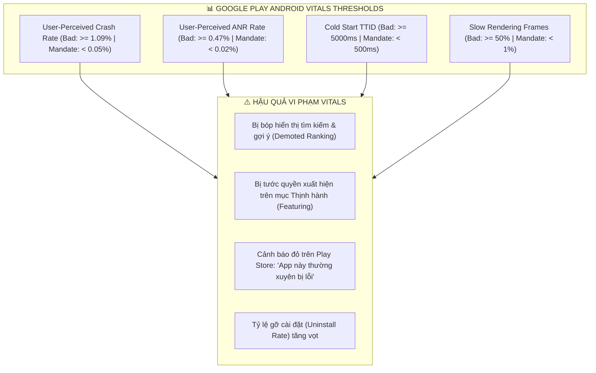
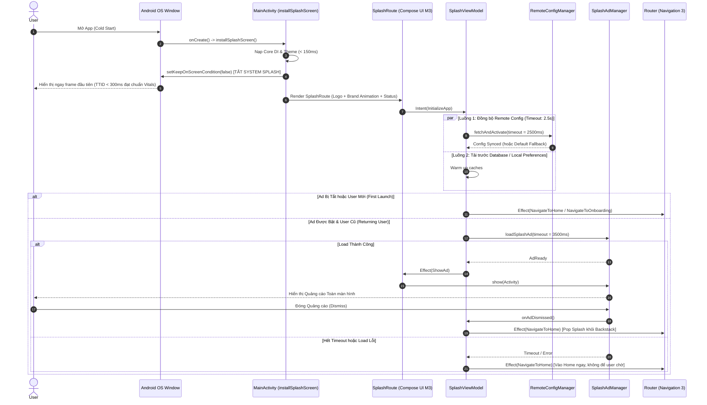

# Android Vitals, App Quality & Splash Orchestrator Architecture

Comprehensive architectural engineering guide for **Google Play Android Vitals, Zero-Crash / Zero-ANR Engineering, Startup Optimization, and 2-Tier Hybrid Splash Orchestration** in Modern Android & Jetpack Compose.

---

## 1. Google Play Android Vitals & Core Budgets

Google Play enforces automated ranking demotions and warning banners for apps exceeding the **Core Vitals Bad Behavior Thresholds**.



---

## 2. Zero-Crash & Safe Concurrency Architecture

Crashes in Android modern applications are predominantly caused by unhandled exceptions in asynchronous Coroutines, nullability mismatch in DTOs, or reflection stripping during R8 minification.

### A. Centralized Exception Handler & Safe Launch
Never invoke `viewModelScope.launch` without a `CoroutineExceptionHandler`. Always inherit from `BaseViewModel` and use the built-in `launch {}` (`safeLaunch`):

```kotlin
// ❌ BAD: Uncaught exception crashes the entire process
fun loadData() {
    viewModelScope.launch {
        val result = repository.fetchRemoteData() // If throws SocketTimeoutException -> CRASH
        _uiState.value = result
    }
}

// ✅ GOOD: Centralized exception capture, Crashlytics reporting & UI Effect emission
fun loadData() {
    launch {
        val result = repository.fetchRemoteData()
        setState { copy(data = result, isLoading = false) }
    }
}
```

### B. Safe DTO to Domain Mapping (Default Fallbacks)
Never allow raw, unvalidated DTO properties to leak into the Domain or Presentation layers:

```kotlin
// ❌ BAD: Missing JSON field or null causes NullPointerException / ClassCastException
data class UserDto(val id: Long, val name: String)

// ✅ GOOD: Resilient mapping with fallback values
@Serializable
data class UserDto(
    @SerialName("id") val id: Long? = null,
    @SerialName("name") val name: String? = null
) {
    fun toDomain(): User = User(
        id = UserId(id ?: 0L),
        name = name.orEmpty()
    )
}
```

---

## 3. Zero-ANR & StrictMode Engineering

An ANR (Application Not Responding) occurs when the Main Thread is blocked for $> 5\text{s}$ (or $> 10\text{s}$ in a BroadcastReceiver). However, any block $> 5\text{ms}$ creates dropped frames and visible UI stutter.

### StrictMode Setup in Application Class (Debug Only)
```kotlin
class App : Application() {
    override fun onCreate() {
        super.onCreate()
        if (BuildConfig.DEBUG) {
            StrictMode.setThreadPolicy(
                StrictMode.ThreadPolicy.Builder()
                    .detectDiskReads()
                    .detectDiskWrites()
                    .detectNetwork()
                    .detectCustomSlowCalls()
                    .penaltyLog()
                    .penaltyFlashScreen()
                    .build()
            )
            StrictMode.setVmPolicy(
                StrictMode.VmPolicy.Builder()
                    .detectLeakedSqlLiteObjects()
                    .detectLeakedClosableObjects()
                    .detectActivityLeaks()
                    .penaltyLog()
                    .build()
            )
        }
    }
}
```

---

## 4. The 2-Tier Hybrid Splash Architecture

The 2-Tier Hybrid Splash Architecture harmonizes ultra-fast **Time to Initial Display (TTID < 500ms)** with real-world startup requirements (**Remote Config, Google UMP GDPR Consent, and Monetization Ad Loading**).



---

## 5. Implementation Blueprints

### A. MainActivity Tier 1 Installation
```kotlin
class MainActivity : ComponentActivity() {

    override fun onCreate(savedInstanceState: Bundle?) {
        val splashScreen = installSplashScreen()
        super.onCreate(savedInstanceState)
        enableEdgeToEdge()

        var isComposeReady by mutableStateOf(false)
        // Dismiss system splash as soon as the first Compose frame renders
        splashScreen.setKeepOnScreenCondition { !isComposeReady }

        setContent {
            AppTheme {
                SideEffect { isComposeReady = true }
                AppNavigationGraph()
            }
        }
    }
}
```

### B. Splash ViewModel Orchestration (MVI)
```kotlin
class SplashViewModel(
    private val remoteConfigManager: RemoteConfigManager,
    private val adManager: SplashAdManager,
    private val appPreferences: AppPreferences
) : BaseViewModel<SplashUiState, SplashIntent, SplashEffect>(SplashUiState()) {

    override fun onIntent(intent: SplashIntent) {
        when (intent) {
            is SplashIntent.InitializeApp -> startStartupPipeline()
            is SplashIntent.OnAdDismissed,
            is SplashIntent.OnAdFailedToShow -> proceedToDestination()
        }
    }

    private fun startStartupPipeline() {
        launch {
            // 1. Fetch Remote Config with 2.5s Timeout
            withTimeoutOrNull(2500L) {
                remoteConfigManager.fetchAndActivate()
            }

            val isAdEnabled = remoteConfigManager.getBoolean("is_splash_ad_enabled", defaultValue = true)
            val isFirstLaunch = appPreferences.isFirstLaunch.first()

            // 2. Onboarding / First Launch bypasses splash ad for D1 retention
            if (isFirstLaunch || !isAdEnabled) {
                proceedToDestination()
                return@launch
            }

            // 3. Load Ad with 3.5s Timeout
            setState { copy(statusText = "Đang tải dữ liệu...", isAdLoading = true) }
            val adResult = withTimeoutOrNull(3500L) {
                adManager.loadSplashAd()
            }

            if (adResult is AdLoadResult.Success) {
                sendEffect(SplashEffect.ShowAd(adResult.ad))
            } else {
                proceedToDestination()
            }
        }
    }

    private fun proceedToDestination() {
        launch {
            val isFirstLaunch = appPreferences.isFirstLaunch.first()
            if (isFirstLaunch) {
                appPreferences.setFirstLaunchCompleted()
                sendEffect(SplashEffect.NavigateToOnboarding)
            } else {
                sendEffect(SplashEffect.NavigateToHome)
            }
        }
    }
}
```

---

## 6. Baseline Profiles Setup Guide (Macrobenchmark)

Baseline Profiles improve cold startup speed by **$40\% - 60\%$** and eliminate frame drops during first-time scrolling.

### Step 1: Add Baseline Profile Generator Module
```kotlin
// In :baselineprofile build.gradle.kts
plugins {
    alias(libs.plugins.android.test)
    alias(libs.plugins.androidx.baselineprofile)
}

@RunWith(AndroidJUnit4::class)
@LargeTest
class StartupBaselineProfileGenerator {
    @get:Rule
    val rule = BaselineProfileRule()

    @Test
    fun generateStartupProfile() = rule.collect(
        packageName = "com.company.app",
        includeInStartupProfile = true
    ) {
        pressHome()
        startActivityAndWait()
        // Scroll home screen to compile lazy list render paths
        device.waitForIdle()
    }
}
```

---

## 7. App Quality Checklist

| Area | Checkpoint | Standard |
| :--- | :--- | :--- |
| **Crash Rate** | `safeLaunch` & DTO mapping | $< 0.05\%$ uncaught exceptions |
| **ANR Rate** | No I/O / DB / JSON on Main | $< 0.02\%$ Main Thread blocking |
| **System Splash**| AndroidX `SplashScreen` API | Dismisses in $< 200\text{ms}$ |
| **Splash Timeout**| `withTimeoutOrNull` | Config $\le 2.5\text{s}$, Ads $\le 3.5\text{s}$ |
| **Ad Safety** | Unmounted ad suppression | Zero ads shown after leaving Splash |
| **Backstack** | Clean-up | Splash popped cleanly upon entering Home |
| **Profiles** | Baseline Profiles | `baseline-prof.txt` generated for release builds |
