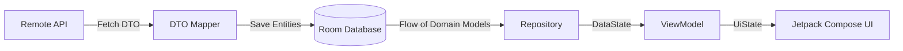

# Modern Android & Jetpack Compose Design Patterns

Comprehensive reference guide for applying **Software Design Patterns** within **Modern Kotlin, Jetpack Compose, MVI, and Clean Architecture**.

---

## 1. Core Philosophy: Modern Kotlin & Compose vs Classical Java OOP

In classical Android development (Java/XML), Gang of Four (GoF) patterns often required extensive boilerplate: abstract classes, multiple factory interfaces, and verbose builder chains.

In **Modern Kotlin & Declarative Jetpack Compose**, design patterns are:
1. **Language First-Class:** Replaced or streamlined by native Kotlin features (first-class functions, default/named arguments, `data class` `.copy()`, class delegation `by`, Coroutines `Flow`, Snapshot State).
2. **Declarative-First:** UI is a pure function of State (`UI = f(State)`). Stateful object hierarchies are replaced with unidirectional data flows (UDF) and hoisted composable functions.
3. **Pragmatic & Lean:** Avoid over-engineering. Design patterns should solve concrete architectural problems, not introduce unnecessary abstraction layers.

---

## 2. Creational Patterns

### A. Factory Method & Abstract Factory
* **Intent:** Encapsulate complex object creation logic without exposing concrete instantiation details to the client.
* **Modern Kotlin Idiom:** Companion object factory functions, top-level DSLs, or sealed interface hierarchies.

```kotlin
// Abstract Factory using Sealed Interfaces
sealed interface EncryptedVaultFactory {
    fun createVault(config: VaultConfig): VaultStorage

    companion object {
        fun create(securityLevel: SecurityLevel): EncryptedVaultFactory = when (securityLevel) {
            SecurityLevel.HARDWARE_BACKED -> StrongBoxVaultFactory()
            SecurityLevel.SOFTWARE_AES -> SoftwareAesVaultFactory()
        }
    }
}

// Factory Method via Companion Object
class VpnConnectionProfile private constructor(
    val serverId: String,
    val cipher: String,
    val mtu: Int
) {
    companion object {
        fun createOpenVpn(server: VpnServer): VpnConnectionProfile =
            VpnConnectionProfile(serverId = server.id, cipher = "AES-256-CBC", mtu = 1500)

        fun createWireGuard(server: VpnServer): VpnConnectionProfile =
            VpnConnectionProfile(serverId = server.id, cipher = "ChaCha20", mtu = 1420)
    }
}
```

### B. Builder Pattern vs Kotlin DSL / Named Arguments
* **Classical Java/OOP:** Writing dedicated builder classes (`ServerConfigBuilder.setHost().setPort().build()`).
* **Modern Kotlin:**
  - **Standard Objects:** Use `data class` with **Named Arguments** and **Default Parameter Values**.
  - **Hierarchical/Complex Configurations:** Use **Type-Safe Builders / Kotlin DSL** marked with `@DslMarker`.

```kotlin
// 1. Named Arguments + Defaults (Recommended for 90% of cases)
data class NetworkConfig(
    val host: String,
    val port: Int = 443,
    val timeoutMillis: Long = 15_000L,
    val enableTls: Boolean = true
)

// 2. Type-Safe DSL Builder with @DslMarker for complex nested configurations
@DslMarker
annotation class VpnDsl

@VpnDsl
class VpnRouteBuilder {
    private val allowedApps = mutableListOf<String>()
    private val excludedIps = mutableListOf<String>()

    fun allowApp(packageName: String) { allowedApps.add(packageName) }
    fun excludeIp(ip: String) { excludedIps.add(ip) }

    fun build(): VpnRouteConfig = VpnRouteConfig(allowedApps, excludedIps)
}

fun vpnRoute(block: VpnRouteBuilder.() -> Unit): VpnRouteConfig =
    VpnRouteBuilder().apply(block).build()

// Usage:
val routeConfig = vpnRoute {
    allowApp("com.android.chrome")
    allowApp("com.spotify.music")
    excludeIp("192.168.1.1")
}
```

### C. Singleton vs DI-Managed Scopes
* **Anti-Pattern Warning:** Avoid global Kotlin `object` containing mutable state (`var`) or Android `Context` references. This causes memory leaks and breaks testability.
* **Modern Way:** Register singletons through **Dependency Injection (Koin `single {}`)**.

```kotlin
// ❌ WRONG: Global object holding mutable state or Context
object BadGlobalManager {
    var context: Context? = null // Leaks Activity/Context
    var currentUser: User? = null // Breaks UDF, cannot be mocked in unit tests
}

// ✅ CORRECT: DI-managed singleton via Koin
class SessionManager(
    private val encryptedDataStore: DataStore<Preferences>
) {
    val sessionState: Flow<Session?> = encryptedDataStore.data.map { ... }
}

// Koin Module registration
val coreModule = module {
    single { SessionManager(get()) }
}
```

### D. Prototype Pattern
* **Intent:** Create new objects by cloning an existing prototype.
* **Modern Kotlin Idiom:** Built-in `data class` `.copy()` method for immutable state updates in MVI / Redux architectures.

```kotlin
data class ServerState(
    val servers: List<VpnServer> = emptyList(),
    val selectedServer: VpnServer? = null,
    val isLoading: Boolean = false,
    val searchQuery: String = ""
) : UiState

// Pure immutable update via Prototype (.copy())
val updatedState = currentState.copy(
    isLoading = false,
    servers = newServerList
)
```

---

## 3. Structural Patterns

### A. Adapter Pattern
* **Intent:** Convert the interface of an existing class into another interface expected by clients.
* **Modern Android Use Cases:**
  1. Bridging Android SDK callback listeners into Kotlin Coroutines `suspendCancellableCoroutine` or `callbackFlow`.
  2. Data boundary mappers (DTO -> Domain Entity -> UiModel).

```kotlin
// Adapter: Android Callback -> Kotlin Coroutines Flow
fun ConnectivityManager.observeNetworkChanges(): Flow<NetworkStatus> = callbackFlow {
    val callback = object : ConnectivityManager.NetworkCallback() {
        override fun onAvailable(network: Network) {
            trySend(NetworkStatus.Available)
        }
        override fun onLost(network: Network) {
            trySend(NetworkStatus.Lost)
        }
    }
    
    val request = NetworkRequest.Builder()
        .addCapability(NetworkCapabilities.NET_CAPABILITY_INTERNET)
        .build()
    registerNetworkCallback(request, callback)

    awaitClose {
        unregisterNetworkCallback(callback)
    }
}.distinctUntilChanged()
```

### B. Decorator Pattern
* **Intent:** Dynamically attach additional responsibilities or behaviors to an object.
* **Modern Kotlin & Compose Way:**
  1. **Compose `Modifier` Extension Pattern:** Chaining UI modifiers.
  2. **Kotlin Class Delegation (`by` keyword):** Wrapping and decorating select interface methods.

```kotlin
// 1. Compose Modifier Decorator
fun Modifier.glassmorphismBorder(
    strokeWidth: Dp = 1.dp,
    cornerRadius: Dp = 16.dp,
    borderColor: Color = Color.White.copy(alpha = 0.15f)
): Modifier = this
    .clip(RoundedCornerShape(cornerRadius))
    .border(
        width = strokeWidth,
        brush = Brush.verticalGradient(
            colors = listOf(borderColor, Color.Transparent)
        ),
        shape = RoundedCornerShape(cornerRadius)
    )

// 2. Class Delegation Decorator
class LoggingAnalyticsRepository(
    private val delegate: AnalyticsRepository,
    private val logger: Logger
) : AnalyticsRepository by delegate {
    override suspend fun logEvent(name: String, params: Map<String, Any>) {
        logger.d("Analytics", "Logging event: $name with params: $params")
        delegate.logEvent(name, params)
    }
}
```

### C. Facade Pattern
* **Intent:** Provide a unified, simplified interface to a complex subsystem.
* **Modern Android Use Case:** Encapsulating complex native Android APIs (e.g., VPN AIDL Service, Media3 ExoPlayer, Biometrics + KeyStore) into a cohesive repository or manager interface.

```kotlin
interface VpnConnectionFacade {
    val connectionState: StateFlow<ConnectionStatus>
    suspend fun connect(server: VpnServer)
    suspend fun disconnect()
}

class VpnConnectionFacadeImpl(
    private val vpnServiceHelper: VPNLaunchHelper,
    private val notificationManager: VpnNotificationManager,
    private val trafficStatsTracker: TrafficStatsTracker
) : VpnConnectionFacade {
    override val connectionState: StateFlow<ConnectionStatus> = vpnServiceHelper.statusFlow

    override suspend fun connect(server: VpnServer) {
        notificationManager.showConnecting(server.country)
        trafficStatsTracker.reset()
        vpnServiceHelper.startVpn(server.config)
    }

    override suspend fun disconnect() {
        vpnServiceHelper.stopVpn()
        notificationManager.cancel()
        trafficStatsTracker.stop()
    }
}
```

### D. Composite Pattern
* **Intent:** Compose objects into tree structures to represent part-whole hierarchies.
* **Modern Android Use Cases:**
  - **Jetpack Compose UI Tree:** Layout nodes composed hierarchically via `@Composable` lambdas.
  - **Composite Use Cases:** Orchestrating multiple independent domain use cases into a single workflow.

---

## 4. Behavioral Patterns

### A. Strategy Pattern
* **Intent:** Define a family of algorithms, encapsulate each one, and make them interchangeable at runtime.
* **Modern Kotlin Way:** First-class functions (lambdas) or sealed interface strategies.

```kotlin
// Strategy via Sealed Interface
sealed interface ServerSortingStrategy {
    fun sort(servers: List<VpnServer>): List<VpnServer>

    data object ByPing : ServerSortingStrategy {
        override fun sort(servers: List<VpnServer>) = servers.sortedBy { it.ping }
    }

    data object BySpeed : ServerSortingStrategy {
        override fun sort(servers: List<VpnServer>) = servers.sortedByDescending { it.speedBytesPerSec }
    }

    data object ByPopularity : ServerSortingStrategy {
        override fun sort(servers: List<VpnServer>) = servers.sortedByDescending { it.connectedUsers }
    }
}

// Strategy via First-Class Functions:
fun filterServers(
    servers: List<VpnServer>,
    predicate: (VpnServer) -> Boolean
): List<VpnServer> = servers.filter(predicate)
```

### B. Observer Pattern (Reactive Streams)
* **Intent:** Define a one-to-many dependency between objects so that when one changes state, all its dependents are notified automatically.
* **Modern Android Way:** Fully replaced by **Kotlin Coroutines `Flow`**, **`StateFlow`**, **`SharedFlow`**, and Compose **`SnapshotState`**.

```kotlin
// Cold Flow (Data Source) -> Hot StateFlow (ViewModel) -> Snapshot State (Compose UI)
class ServerRepositoryImpl(private val serverDao: VpnServerDao) : ServerRepository {
    override fun getSelectedServer(): Flow<VpnServer?> = 
        serverDao.getSelectedServerFlow().map { it?.toDomain() }
}

class ServerViewModel(repository: ServerRepository) : BaseViewModel<ServerState, ServerIntent, ServerEffect>(ServerState()) {
    init {
        safeLaunch {
            repository.getSelectedServer().collect { server ->
                updateState { copy(selectedServer = server) }
            }
        }
    }
}
```

### C. Command Pattern & MVI Intent
* **Intent:** Encapsulate a request as an object, thereby letting you parameterize clients with different requests, queue or log requests, and support undoable operations.
* **Modern Android / MVI Application:** MVI **`Intent`** (or `UiEvent`) represents the Command Pattern within Unidirectional Data Flow (UDF).

```kotlin
sealed interface ServerIntent : MVIIntent {
    data class SelectCategory(val category: ServerCategory) : ServerIntent
    data class SearchQueryChanged(val query: String) : ServerIntent
    data class ToggleFavorite(val serverId: String) : ServerIntent
    data class ConnectServer(val server: VpnServer) : ServerIntent
    data object RefreshServers : ServerIntent
}

// ViewModel dispatcher executes the command
override fun onIntent(intent: ServerIntent) {
    when (intent) {
        is ServerIntent.SelectCategory -> handleSelectCategory(intent.category)
        is ServerIntent.SearchQueryChanged -> handleSearch(intent.query)
        is ServerIntent.ToggleFavorite -> handleToggleFavorite(intent.serverId)
        is ServerIntent.ConnectServer -> handleConnect(intent.server)
        is ServerIntent.RefreshServers -> handleRefresh()
    }
}
```

### D. State Pattern (Finite State Machine - FSM)
* **Intent:** Allow an object to alter its behavior when its internal state changes.
* **Modern Android / Compose Way:** Represent mutually exclusive discrete states using **`sealed interface UiState`**.

```kotlin
sealed interface VpnConnectionUiState : UiState {
    data object Disconnected : VpnConnectionUiState
    data class Connecting(val progress: Float, val statusMessage: String) : VpnConnectionUiState
    data class Connected(val sessionDurationSeconds: Long, val downloadSpeed: Long) : VpnConnectionUiState
    data class Error(val errorReason: VpnErrorType) : VpnConnectionUiState
}

// Declarative UI renders deterministically based on State
@Composable
fun VpnStatusSection(state: VpnConnectionUiState, modifier: Modifier = Modifier) {
    when (state) {
        is VpnConnectionUiState.Disconnected -> DisconnectedView()
        is VpnConnectionUiState.Connecting -> ConnectingIndicator(progress = state.progress)
        is VpnConnectionUiState.Connected -> ActiveDashboard(duration = state.sessionDurationSeconds)
        is VpnConnectionUiState.Error -> ErrorBanner(error = state.errorReason)
    }
}
```

### E. Chain of Responsibility
* **Intent:** Pass requests along a chain of handlers. Upon receiving a request, each handler decides either to process it or pass it to the next handler.
* **Modern Android Use Cases:** Ktor / OkHttp **Interceptors**, Navigation Guards, and Permission Request Chains.

```kotlin
class AuthHeaderInterceptor(private val tokenProvider: TokenProvider) : Interceptor {
    override fun intercept(chain: Interceptor.Chain): Response {
        val originalRequest = chain.request()
        val token = tokenProvider.getAuthToken()
        
        val authenticatedRequest = if (token != null) {
            originalRequest.newBuilder()
                .header("Authorization", "Bearer $token")
                .build()
        } else {
            originalRequest
        }
        
        return chain.proceed(authenticatedRequest) // Pass to next handler in chain
    }
}
```

---

## 5. Compose-Specific & Architectural Patterns

### A. Slot API Pattern
* **Intent:** Design UI components with customization slots using `@Composable () -> Unit` parameters rather than hardcoding children.
* **Benefit:** Maximum reusability and extensibility across the Design System.

```kotlin
@Composable
fun AppCard(
    modifier: Modifier = Modifier,
    header: (@Composable () -> Unit)? = null,
    trailingAction: (@Composable () -> Unit)? = null,
    content: @Composable () -> Unit
) {
    Surface(
        modifier = modifier.fillMaxWidth(),
        shape = AppShapes.large,
        color = AppTheme.colors.surface
    ) {
        Column(modifier = Modifier.padding(AppSpacing.md)) {
            if (header != null || trailingAction != null) {
                Row(
                    modifier = Modifier.fillMaxWidth(),
                    horizontalArrangement = Arrangement.SpaceBetween,
                    verticalAlignment = Alignment.CenterVertically
                ) {
                    header?.invoke()
                    trailingAction?.invoke()
                }
                Spacer(modifier = Modifier.height(AppSpacing.sm))
            }
            content()
        }
    }
}
```

### B. State Hoisting & Router-Screen Pattern
* **Intent:** Decouple stateful orchestration from pure declarative UI rendering to enable 100% stable `@Preview` rendering, isolation of side-effects/permissions, and testability.

```kotlin
// 1. Stateful Router (Connects ViewModel / Koin DI / Permissions / Dialogs / System Events)
@Composable
fun ServerRoute(
    onNavigateBack: () -> Unit,
    viewModel: ServerViewModel = koinViewModel(),
    modifier: Modifier = Modifier
) {
    val uiState by viewModel.uiState.collectAsStateWithLifecycle()
    
    // Manage permissions & one-off effects here...
    
    ServerScreen(
        uiState = uiState,
        onIntent = viewModel::onIntent,
        onNavigateBack = onNavigateBack,
        modifier = modifier
    )
}

// 2. Stateless Screen (Pure Declarative UI - 100% Decoupled from ViewModel)
@Composable
fun ServerScreen(
    uiState: ServerUiState,
    onIntent: (ServerIntent) -> Unit,
    onNavigateBack: () -> Unit,
    modifier: Modifier = Modifier
) {
    Box(modifier = modifier.fillMaxSize().background(AppTheme.colors.background)) {
        // Pure declarative UI layout...
    }
}

// 3. Mandatory Previews (Offline Studio Rendering with Mock Data)
@Preview(name = "Light Mode", showBackground = true)
@Preview(name = "Dark Mode", uiMode = Configuration.UI_MODE_NIGHT_YES)
@Composable
private fun ServerScreenPreview(
    @PreviewParameter(ServerUiStatePreviewParameterProvider::class) uiState: ServerUiState
) {
    AppTheme {
        ServerScreen(
            uiState = uiState,
            onIntent = {},
            onNavigateBack = {}
        )
    }
}

### C. Single Source of Truth (SSOT) & NetworkBoundResource
* **Intent:** The local database (Room) serves as the Single Source of Truth. Remote APIs update local storage, and UI reacts solely to database streams.



```kotlin
inline fun <ResultType, RequestType> networkBoundResource(
    crossinline query: () -> Flow<ResultType>,
    crossinline fetch: suspend () -> RequestType,
    crossinline saveFetchResult: suspend (RequestType) -> Unit,
    crossinline shouldFetch: (ResultType) -> Boolean = { true }
): Flow<DataState<ResultType>> = flow {
    emit(DataState.Loading)
    val localData = query().first()
    
    if (shouldFetch(localData)) {
        emit(DataState.Success(localData, isRefreshing = true))
        try {
            val remoteData = fetch()
            saveFetchResult(remoteData)
            query().collect { updatedData ->
                emit(DataState.Success(updatedData, isRefreshing = false))
            }
        } catch (e: Exception) {
            emit(DataState.Error(e, fallbackData = localData))
        }
    } else {
        query().collect { cachedData ->
            emit(DataState.Success(cachedData, isRefreshing = false))
        }
    }
}
```

---

## 6. Decision Matrix & Anti-Patterns (When to Use vs Avoid)

| Design Pattern | Recommended When | Avoid When (Anti-Pattern / Over-engineering) |
|---|---|---|
| **Builder** | Nested, hierarchical configurations (DSL with `@DslMarker`). | Simple classes with < 5 parameters (use Kotlin Named Args + Defaults). |
| **Factory** | Dynamic polymorphism based on runtime configuration / platform type. | Trivial instantiation (`ItemFactory` that only calls `return Item(...)`). |
| **Singleton** | Registered via Koin `single {}` for stateless services/repositories. | Global `object` with mutable `var` state or holding Android `Context`. |
| **Strategy** | Sorting, encryption, or routing algorithms selectable by user setting. | Creating interface hierarchies for simple 2-branch `if/else` logic. |
| **Observer** | Real-time reactive data streams from Room / Network via `Flow`. | Nested callback interfaces (Callback Hell). |
| **Command** | MVI `Intent` representing user actions audited/queued in UDF. | Wrapping simple internal composable UI setters into Command objects. |
| **Facade** | Encapsulating complex Android Native APIs (VPN AIDL, ExoPlayer, Camera2). | Wrapping a single repository method with zero added value. |
| **Slot API** | Design System components needing flexible child customization. | Leaf components with rigid layout specifications (e.g. static icon badge). |
