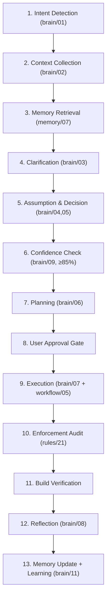

# Skill: Request Processing & Master Workflow Execution

## Overview

This skill is a **quick reference** for the mandatory execution pipeline defined in the Master Workflow.

> ⚠️ **IMPORTANT:** This skill does NOT define its own pipeline. It references the unified Master Pipeline defined in:
> - `workflow/00-master-workflow.md` (authoritative source)
> - `INDEX.md` (full cross-reference map)

---

## Related Files

- Workflow: `workflow/00-master-workflow.md` (Master Pipeline — authoritative)
- Brain: `brain/00-master-cognition.md` (Cognitive Pipeline)
- Rules: `rules/00-system-mandate.md` (Execution Order)
- Rules: `rules/21-enforcement-engine.md` (Quality Gate)

---

## Unified Master Pipeline (Quick Reference)



---

## Phase Details (Mapped to Framework Files)

### Phase 1: Intent Detection
- **Engine:** `brain/01-communication-engine.md`
- Capture user request, determine scope, classify task type

### Phase 2: Context Collection
- **Engine:** `brain/02-context-engine.md`
- Inspect codebase, locate relevant files, identify existing patterns
- Check `core/ui/theme/` for reusable Design System tokens

### Phase 3: Memory Retrieval
- **Engine:** `memory/07-context-retrieval.md`
- Retrieve project knowledge, session context, previous decisions

### Phase 4: Clarification
- **Engine:** `brain/03-clarification-engine.md`
- Ask only questions that context cannot answer

### Phase 5: Assumption & Decision
- **Engines:** `brain/04-assumption-engine.md`, `brain/05-decision-engine.md`
- Validate assumptions, choose execution strategy

### Phase 6: Confidence Check
- **Engine:** `brain/09-confidence-engine.md`
- Confidence ≥85% → proceed. Below → clarify with user.

### Phase 7: Planning
- **Engine:** `brain/06-planning-engine.md`
- Create plan file under `plan/` directory
- For complex tasks only; simple tasks skip to Phase 9

### Phase 8: User Approval Gate
- Present plan to user, wait for explicit approval
- **Mandatory per:** `memory/06-user-preference-memory.md` (Clarification & Confirmation Rule)

### Phase 9: Execution
- **Engine:** `brain/07-execution-engine.md`
- **Workflow:** `workflow/05-feature-development.md`
- Implement from: `Core/Theme` → `Domain` → `Data` → `Components` → `Screen` → `Route`
- Apply rules: `rules/04-feature-construction.md`, `rules/05-design-system.md`, `rules/07-viewmodel.md`

### Phase 10: Enforcement Audit
- **Rules:** `rules/21-enforcement-engine.md`
- Self-audit all modified files against applicable enforcement categories (E1-E10)
- ZERO violations required before proceeding

### Phase 11: Build Verification
- Run `./gradlew compileDebugKotlin` → BUILD SUCCESSFUL
- Run `./gradlew test` → BUILD SUCCESSFUL
- **Mandatory per:** `memory/06-user-preference-memory.md` (Pre-Completion Verification Rule)

### Phase 12: Reflection
- **Engine:** `brain/08-reflection-engine.md`
- Verify architecture, code quality, error handling, performance, security

### Phase 13: Memory Update + Learning
- **Engine:** `brain/11-learning-engine.md`
- Update: `memory/01-project`, `memory/03-task`, `memory/04-decision`, `memory/05-pattern`
- Extract reusable patterns for future tasks

---

## Fast-Track Mode

For simple tasks (single file edit, typo fix, string change):

```text
Skip: Phase 4 (Clarification), Phase 5 (Assumption), Phase 7 (Planning)
Keep: Phase 2 (Context), Phase 8 (Approval for code changes), Phase 10-11 (Enforcement + Build)
```

For medium tasks (feature modification, bug fix):

```text
Skip: Phase 7 (Planning)
Keep: All other phases
```

For complex tasks (new feature, architecture change):

```text
Skip: Nothing — full pipeline required
```
