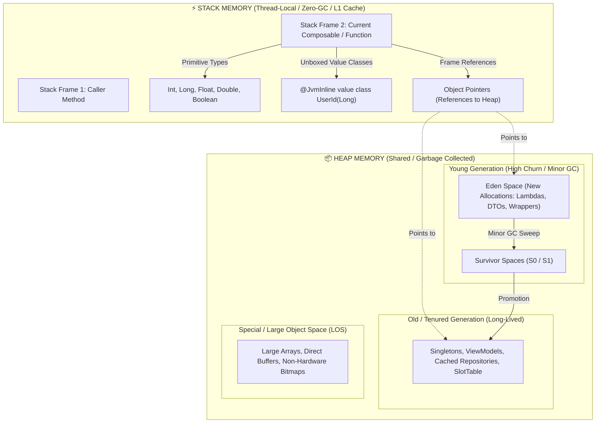

# Stack & Heap Memory Architecture

Comprehensive architectural engineering guide for **Stack vs Heap Memory Management** in Kotlin Multiplatform (KMP), Android Jetpack Compose, Kotlin Coroutines, and Data Streams.

---

## 1. System Memory Model (ART & JVM Internals)

Understanding how the Android Runtime (ART) and JVM allocate and reclaim memory is essential for writing zero-jank, high-throughput software.



### The Cost of Heap Allocation vs Stack Frame
1. **Stack Allocation ($O(1)$):** Moving the Stack Pointer (`SP`) down. Instantaneous. Deallocation happens automatically when the function returns by restoring `SP`. **Zero Garbage Collection overhead.**
2. **Heap Allocation ($O(N)$):** Finding free memory in Eden space, initializing object headers (Mark Word, Class Pointer, Alignment padding — at least 16 bytes per object), and tracking references.
3. **GC Pauses & Frame Budget:**
   - On a **60Hz display**, frame budget is **16.6ms**.
   - On a **120Hz display (ProMotion / High-Refresh)**, frame budget is **8.3ms**.
   - Frequent allocations in hot paths (Composition, Canvas drawing, Scroll listeners) trigger **Concurrent Mark-Compact (CMC) / Minor GC sweeps**. Even a 3ms GC pause can cause a dropped frame (jank / stutter).

---

## 2. Escape Analysis & Scalar Replacement

The JIT/AOT compiler performs **Escape Analysis** to determine if an object's lifetime is strictly confined to the executing stack frame:
- **No Escape (Local):** The object is never returned, stored in a field, or passed to non-inlined functions. ART can perform **Scalar Replacement** (dissolving the object into primitive stack variables).
- **Escape (Heap Allocation):** If an object escapes the local scope (passed to an interface, stored in a state holder, or captured in a non-inlined lambda), it MUST be allocated on the Heap.

### Practical Application: Inline Functions
```kotlin
// ❌ BAD: Lambda escapes -> Compiles to new Function0 object on Heap every invocation
fun <T> executeTask(block: () -> T): T {
    return block()
}

// ✅ GOOD: Inline -> Compiler pastes bytecode directly into the caller's Stack frame
// Zero Function0 object allocation; zero Heap overhead
inline fun <T> executeTask(block: () -> T): T {
    return block()
}
```

---

## 3. Kotlin Value Classes (`@JvmInline value class`)

Value classes provide type-safety without the object allocation penalty by unboxing directly to primitives on the Stack.

### Unboxed (Stack) vs Boxed (Heap) Scenarios

| Usage Scenario | Stack vs Heap | Why? |
| :--- | :--- | :--- |
| `val id = UserId(100L)` inside method | **Stack (Unboxed `long`)** | Direct primitive value representation |
| Method parameter `fun load(id: UserId)` | **Stack (Unboxed `long`)** | Mapped directly to primitive signature in bytecode |
| Property in `@Immutable data class User(val id: UserId)` | **Heap (Inlined field)** | Stored as a primitive `long` field inside the parent object |
| Cast to `Any` (`val x: Any = id`) | **Heap (Boxed Object)** | Generic type erasure forces wrapper object allocation |
| Nullable Value Class (`val id: UserId? = null`) | **Heap (Boxed Object)** | Primitives cannot represent `null` on JVM/ART |
| Inside standard `List<UserId>` | **Heap (Boxed Object)** | `java.util.List` requires reference objects |
| Inside `LongArray` / Custom Struct | **Stack / Raw Buffer** | Pure unboxed memory continuity |

```kotlin
// Definition:
@JvmInline
value class FileId(val value: Long)

@JvmInline
value class DurationMs(val value: Long)

@JvmInline
value class BitrateKbps(val value: Int)
```

---

## 4. Jetpack Compose Memory Optimization

Jetpack Compose stores UI tree metadata in an internal **SlotTable** (a flat contiguous array on the Heap). Minimizing transient Heap allocations keeps the SlotTable and Eden space lean.

### A. Primitive Snapshot State Specialization
Standard `mutableStateOf<T>()` with primitives boxes values into `java.lang.Integer`, `java.lang.Float`, creating wrapper instances on every mutation.

```kotlin
// ❌ BAD: Autoboxing Heap allocation on every frame change
val counter = remember { mutableStateOf(0) }
val scrollOffset = remember { mutableStateOf(0f) }

// ✅ GOOD: Stack-specialized backing field (Zero Heap wrapper allocation)
val counter = remember { mutableIntStateOf(0) }
val scrollOffset = remember { mutableFloatStateOf(0f) }
val progress = remember { mutableDoubleStateOf(0.0) }
val timestamp = remember { mutableLongStateOf(0L) }
```

### B. Composable Body vs Layout / Draw Phase
```kotlin
// ❌ BAD: Allocates 120 times/sec during fast scroll
@Composable
fun TransactionRow(transaction: Transaction) {
    // 1. Heavy allocation inside composition
    val formatter = SimpleDateFormat("dd MMM yyyy", Locale.getDefault())
    val displayDate = formatter.format(Date(transaction.timestamp))
    
    // 2. Transient object inside composition
    Box(
        modifier = Modifier.offset(x = (transaction.offset).dp)
    ) {
        Text(displayDate)
    }
}

// ✅ GOOD: Pre-calculated in ViewModel & deferred to Layout phase
@Composable
fun TransactionRow(
    item: TransactionUiModel, // Pre-formatted upstream
    modifier: Modifier = Modifier
) {
    Box(
        // Reads in Layout phase via lambda -> Zero Composition recomposition
        modifier = modifier.offset { IntOffset(item.offsetX, 0) }
    ) {
        Body1(text = item.formattedDate)
    }
}
```

---

## 5. Collection & Data Stream Pipelines: Sequence vs Iterable

### The Intermediate Heap Allocation Problem
Standard `Iterable` operators (`.filter()`, `.map()`, `.distinct()`) are **eager**: each step allocates a brand-new `ArrayList` on the Heap.

```kotlin
// ❌ BAD: 10,000 items -> Allocates 3 ArrayLists on Heap (~1.2MB churn)
val activeUserNames = users
    .filter { it.isActive }       // Allocates ArrayList #1
    .map { it.fullName }          // Allocates ArrayList #2
    .take(20)                     // Allocates ArrayList #3
    .toList()

// ✅ GOOD: Sequence (Lazy evaluation) -> Zero intermediate ArrayLists
// Elements flow one-by-one through the pipeline on the Stack
val activeUserNames = users.asSequence()
    .filter { it.isActive }
    .map { it.fullName }
    .take(20)
    .toList()                     // Only 1 final List allocated on Heap
```

### Primitive Arrays vs Boxed Collections
In high-frequency computing (Audio visualizers, DSP, Cryptography, Canvas paths):
- Use `IntArray`, `FloatArray`, `ByteArray`, `LongArray`
- DO NOT use `Array<Int>`, `List<Int>`, `List<Float>` (avoids $3\times$ to $5\times$ memory overhead due to `java.lang.Integer` object headers).

---

## 6. Coroutine & Asynchronous Memory Safety

### Continuation Object Allocation
Every `suspend` point creates a `Continuation` state machine object on the Heap.
- Avoid unnecessary suspension points in tight loops.
- Avoid nested `withContext(Dispatchers.IO)` switches inside hot iteration paths; hoist `withContext` outside the loop.

```kotlin
// ❌ BAD: Swapping dispatchers 1,000 times -> Allocates 1,000 Continuation/Task objects
suspend fun processBatch(items: List<ByteArray>) {
    items.forEach { data ->
        withContext(Dispatchers.Default) {
            encryptData(data)
        }
    }
}

// ✅ GOOD: Single dispatcher switch for the entire batch
suspend fun processBatch(items: List<ByteArray>) = withContext(Dispatchers.Default) {
    items.forEach { data ->
        encryptData(data)
    }
}
```

---

## 7. Memory Leak Prevention & Heap Retention Audit

### Symmetrical Resource Disposal
```kotlin
// ✅ GOOD: Guarantees immediate dereferencing from Heap when leaving composition
@Composable
fun SensorMonitor(sensorManager: SensorManager, sensor: Sensor) {
    val context = LocalContext.current
    DisposableEffect(sensorManager, sensor) {
        val listener = object : SensorEventListener {
            override fun onSensorChanged(event: SensorEvent?) { /* ... */ }
            override fun onAccuracyChanged(sensor: Sensor?, accuracy: Int) {}
        }
        sensorManager.registerListener(listener, sensor, SensorManager.SENSOR_DELAY_UI)
        
        onDispose {
            sensorManager.unregisterListener(listener)
        }
    }
}
```

### Zero Context / Activity Leak in ViewModels
```kotlin
// ❌ CRITICAL LEAK: ViewModel outlives Activity, leaking the entire Activity & View hierarchy
class HomeViewModel(private val activity: Activity) : BaseViewModel<...>()

// ✅ GOOD: Inject Application context or domain use cases only
class HomeViewModel(
    private val observeFilesUseCase: ObserveFilesUseCase,
    private val appPreferences: AppPreferences
) : BaseViewModel<...>()
```

---

## 8. Stack vs Heap Architecture Checklist

| Area | Rule | Target Standard |
| :--- | :--- | :--- |
| **Domain IDs** | Value Classes | `@JvmInline value class` for all raw IDs and metric units |
| **Compose State**| Primitives | `mutableIntStateOf`, `mutableFloatStateOf`, `mutableLongStateOf` |
| **Composition** | Zero Allocations | No `SimpleDateFormat`, `Regex`, or list operations in `@Composable` body |
| **Lambdas** | Inline & Memoization | `inline fun` for utility helpers; method refs (`::`) in Composables |
| **Collections** | Sequences | `.asSequence()` for chained transformations ($\ge 2$ steps) |
| **Hot Computing**| Primitive Arrays | `IntArray`, `FloatArray`, `ByteArray` in DSP / Canvas loops |
| **Lifecycles** | Symmetrical Cleanup| `DisposableEffect.onDispose` and `ViewModel.onCleared()` |
| **Contexts** | Strict Isolation | Zero `Activity`, `View`, or UI `Context` in ViewModels / Singletons |
| **Graphics** | Hardware Buffers | `Bitmap.Config.HARDWARE` and 16KB ELF memory page alignment |
