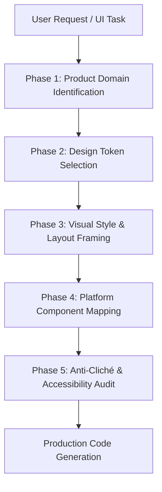

# UI/UX Pro Max Skill (Antigravity Custom Skill)

## Overview & Purpose
The `ui-ux-pro-max` skill equips Antigravity AI Agents with professional design intelligence to eliminate "AI Design Clichés" (e.g., generic dark violet backgrounds, basic rounded cards, gradient text fills, unnecessary pill badges) and produce world-class, human-grade UI/UX designs.

It serves as an expert UI/UX Principal Architect when creating, refactoring, or reviewing user interfaces across Web (HTML/CSS/JS) and Android (Kotlin Jetpack Compose Material 3).

---

## Mandate: Function-Driven Design & Anti-Cliché Rules

### 1. Function-Driven Design (Tư duy thiết kế theo chức năng)
- Analyze the primary utility of the product before choosing any visual style.
- Prioritize frictionless interaction, information hierarchy, and visual scannability.
- Every pixel, container, padding, and micro-interaction must earn its place.

### 2. Forbidden Cliché Design Tropes (Tuyệt đối cấm)
UNLESS explicitly requested by the user, DO NOT produce:
- ❌ **No Purple on Dark:** Purple fonts or violet accents on dark theme backgrounds.
- ❌ **No Colored Border Accents:** Glowing colored outlines or high-contrast border accents around dark containers.
- ❌ **No Headline Biscuit Pills:** Biscuit/pill badges with pulsing dots placed above main titles.
- ❌ **No Gradient Keywords:** CSS/Brush gradient text fills across single headline keywords.
- ❌ **No Grid Backgrounds:** Grid line pattern overlays or particle mesh backgrounds.
- ❌ **No Over-Nested Cards:** Cards containing 3+ nested cards inside.
- ❌ **No Icon-Stuffed Bento Boxes:** Bento boxes with unrelated icons crammed everywhere.
- ❌ **No Hardcoded Static Colors/Dimensions:** Hardcoded `Color(0x...)` or raw static pixel offsets.

---

## The 5-Phase UI/UX Reasoning Engine

When responding to any UI design or implementation task, follow this exact reasoning pipeline:

### Phase 1: Product Domain Identification (160+ Product Types)
Map the target application to its domain to determine visual density and mood:
- **Fintech & Banking:** High trust, clean typography, tabular numbers, subtle surfaces, clear status indicators.
- **SaaS & Dashboards:** High scannability, compact spacing, clear visual hierarchy, subtle card elevation.
- **E-Commerce & Retail:** Vibrant product focus, high-contrast CTA buttons, clear price tags, smooth imagery aspect ratios.
- **Healthcare & Wellness:** Calm palettes (teal/soft blue/sage), generous whitespace, legible text, accessible touch targets.
- **Media & Entertainment:** Rich visuals, immersive dark modes, dynamic hero banners, subtle glassmorphism overlay.
- **Mobile Utilities & Tools:** Instant action buttons, zero fluff, clear status feedback, defensive error states.

*Refer to `references/product-reasoning.md` for the full matrix.*

### Phase 2: Design Token Selection (Color, Typography, Spacing)
1. **Color Palette:** Select a primary domain-tailored color palette from `references/palettes.md`. Ensure strict contrast ratio (WCAG AA: 4.5:1 for body text, 3:1 for large headers).
2. **Typography Pairings:** Select an expressive header + body font pairing from `references/fonts.md`. Apply precise tracking/letter-spacing (negative tracking for large display headers, neutral/positive for small captions).
3. **Spacing System:** Enforce a strict 4dp / 8dp grid system (4, 8, 12, 16, 24, 32, 48, 64dp).

### Phase 3: Visual Style & Layout Framing (240+ Styles)
Select an appropriate UI style from `references/styles.md`:
- **Material Design 3 (Default for Android):** Tonal color roles, dynamic color adaptability, standard surface containers.
- **Minimalist & Clean:** Generous whitespace, subtle neutral borders (`1.dp`), zero decorative fluff.
- **Editorial / Magazine:** High contrast display typography, grid alignment, asymmetric content blocks.
- **Glassmorphism / Frosted Surfaces:** Used sparingly for sticky headers and top app bars (`blur`, semi-transparent background).

### Phase 4: Platform Component Mapping

#### A. Web (HTML/CSS/JS)
- Use CSS Custom Properties (variables) for design tokens (`--color-primary`, `--spacing-md`).
- Use HSL colors for dynamic theme manipulation (`hsl(var(--primary-h), var(--primary-s), var(--primary-l))`).
- Responsive flexbox / CSS grid without dynamic content shifting.

#### B. Android Jetpack Compose (Material 3)
- Use `AppTheme.colors.*` (`ColorScheme`), `AppTheme.typography.*`, `AppSpacing.*`, `AppShapes.*`.
- State-driven reactivity with MVI/UDF (`BaseViewModel<State, Intent, Effect>`).
- Recomposition stability using `@Immutable` data models and memoized lambdas.

*Refer to `references/jetpack-compose-mapping.md` for explicit Compose mappings.*

### Phase 5: Anti-Cliché & Accessibility Audit
Before finalizing code output, run the 5-point self-audit:
1. Are there any forbidden design tropes present?
2. Are all text elements accessible with sufficient contrast ratio in both Light and Dark mode?
3. Are all interactive targets at least 48x48dp / 44x44px?
4. Are loading, empty, success, and error states gracefully handled?
5. Are colors and spacing reference tokens instead of hardcoded raw values?

---

## Reference Data Catalog

This skill provides the following reference catalogs in the `references/` directory:
- [`references/styles.md`](~/.antigravity/skills/ui-ux-pro-max/references/styles.md): Detailed catalog of 240+ UI styles and layout patterns.
- [`references/palettes.md`](~/.antigravity/skills/ui-ux-pro-max/references/palettes.md): 170+ domain-tailored color palettes (Fintech, SaaS, E-commerce, Media, Health, Tools).
- [`references/fonts.md`](~/.antigravity/skills/ui-ux-pro-max/references/fonts.md): 150+ Font pairings and typographic specs.
- [`references/product-reasoning.md`](~/.antigravity/skills/ui-ux-pro-max/references/product-reasoning.md): Matrix mapping 160+ product types to visual rules.
- [`references/jetpack-compose-mapping.md`](~/.antigravity/skills/ui-ux-pro-max/references/jetpack-compose-mapping.md): Jetpack Compose Material 3 implementation mapping guide.
